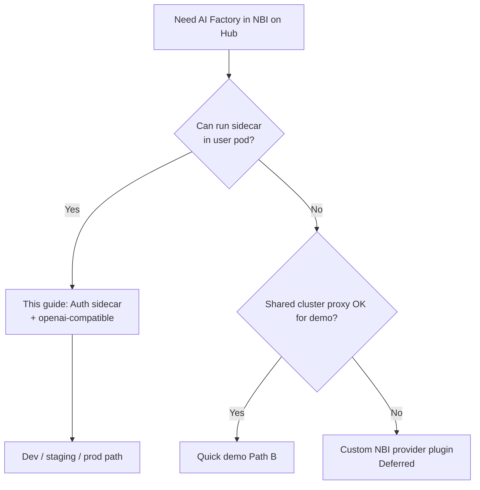
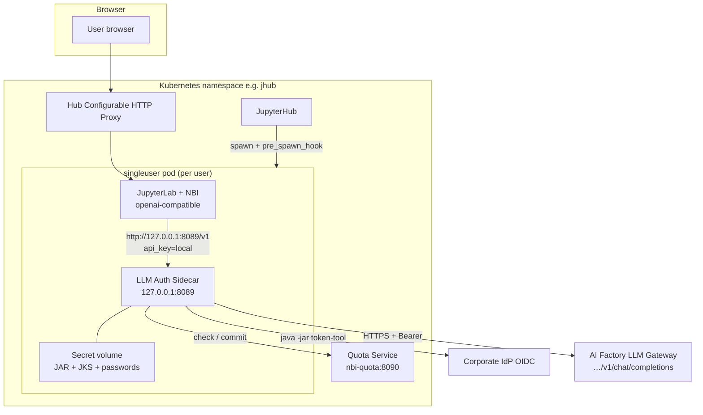
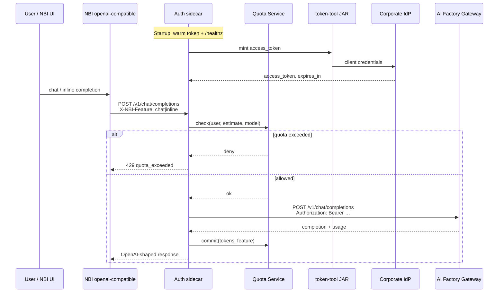
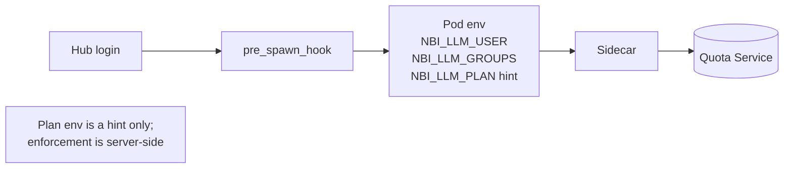
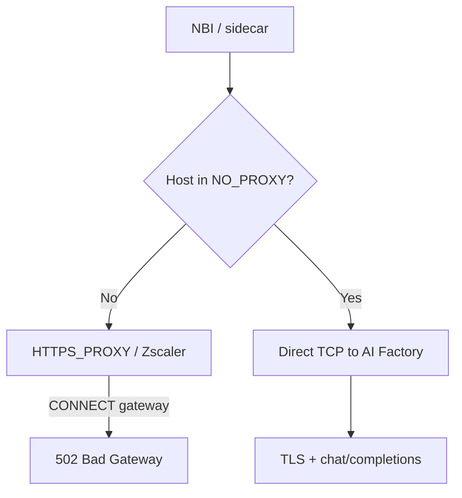
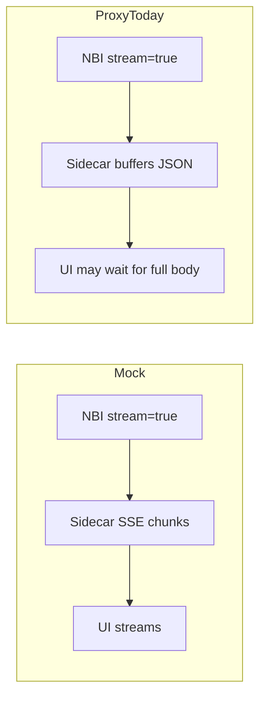
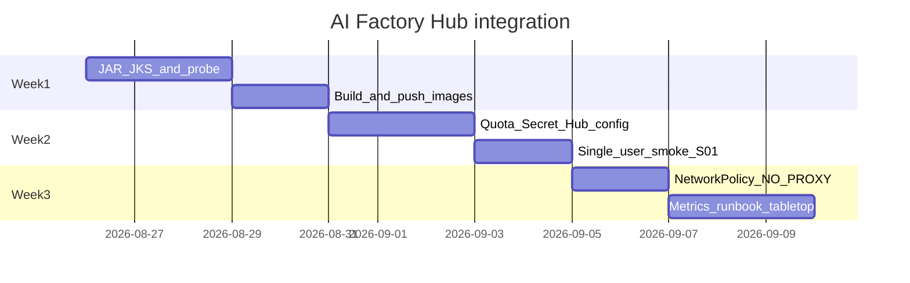

# Kubernetes Deployment Guide: JupyterHub + Notebook Intelligence × AI Factory LLM Gateway

**Audience:** Platform / ML platform engineers deploying on an internal Kubernetes (dev or staging) cluster.  
**Status:** Implementation guide aligned with the in-repo spike under [`../local-dev/`](../local-dev/README.md).  
**Date:** 2026-08-26

**Related documents:**

| Doc                                                                                | Purpose                                  |
| ---------------------------------------------------------------------------------- | ---------------------------------------- |
| [`internal-llm-gateway-integration.md`](internal-llm-gateway-integration.md)       | Requirements & architecture spec         |
| [`ai-factory-quick-demo.md`](ai-factory-quick-demo.md)                             | Fastest Path A/B demo (no image rebuild) |
| [`handoff-internal-llm-gateway.md`](handoff-internal-llm-gateway.md)               | Project handoff                          |
| [`../local-dev/docs/go-live-checklist.md`](../local-dev/docs/go-live-checklist.md) | Cluster go-live checklist                |
| [`../local-dev/docs/runbook.md`](../local-dev/docs/runbook.md)                     | Operator runbook                         |

---

## Contents

1. [Goal and design decision](#1-goal-and-design-decision)
2. [Target architecture](#2-target-architecture)
3. [Component inventory](#3-component-inventory)
4. [Prerequisites](#4-prerequisites)
5. [Phase 1 — Build images](#5-phase-1--build-images)
6. [Phase 2 — Cluster secrets and Quota Service](#6-phase-2--cluster-secrets-and-quota-service)
7. [Phase 3 — JupyterHub / KubeSpawner configuration](#7-phase-3--jupyterhub--kubespawner-configuration)
8. [Phase 4 — NBI baked config and provider lock](#8-phase-4--nbi-baked-config-and-provider-lock)
9. [Phase 5 — NetworkPolicy and corporate proxy](#9-phase-5--networkpolicy-and-corporate-proxy)
10. [Phase 6 — Observability](#10-phase-6--observability)
11. [Verification and acceptance](#11-verification-and-acceptance)
12. [Known limitations](#12-known-limitations)
13. [Dev vs production](#13-dev-vs-production)
14. [File index](#14-file-index)

---

## 1. Goal and design decision

### 1.1 Goal

On **JupyterHub / Kubernetes**, let each user open JupyterLab and use **Notebook Intelligence (NBI)** against the corporate **AI Factory** OpenAI-compatible gateway (example model: `databricks/gdp-gpt4o`), with:

- No GitHub Copilot dependency
- OIDC token minting via corporate **Java JAR + JKS** (not a long-lived key in Settings)
- Per–Hub-user identity and quota metering
- TLS using corporate CAs (prefer CA trust over `verify=False`)

### 1.2 Recommended architecture (accepted ADR)

**Do not** call AI Factory directly from NBI in production.  
**Do not** embed the JAR inside the NBI Python process.

Use:

> **Auth sidecar (in the user pod) + stock NBI `openai-compatible` provider**

See [`../local-dev/docs/adr-sidecar-vs-plugin.md`](../local-dev/docs/adr-sidecar-vs-plugin.md).

For a **same-day demo** without rebuilding images, use [`ai-factory-quick-demo.md`](ai-factory-quick-demo.md) (Path A/B) first, then migrate to this guide.



---

## 2. Target architecture

### 2.1 Cluster view



### 2.2 Request sequence



### 2.3 Identity and quota path



---

## 3. Component inventory

| Component                         | Form                             | Responsibility                              |
| --------------------------------- | -------------------------------- | ------------------------------------------- |
| JupyterHub                        | Existing Helm / chart            | Auth, spawn, routing                        |
| Singleuser image `nbi-singleuser` | Custom image                     | JL + NBI + sidecar code + `entrypoint.sh`   |
| LLM Auth Sidecar                  | Process in user pod (entrypoint) | JAR mint, TLS, proxy `/v1/*`, quota check   |
| Quota Service `nbi-quota`         | Deployment + Service `:8090`     | Plan resolve, counters, boost API           |
| Secret `nbi-llm-auth`             | K8s Secret                       | `token-tool.jar`, JKS, passwords            |
| NetworkPolicy                     | Optional on dig, required later  | Deny direct gateway from notebook code      |
| NBI                               | Stock `openai-compatible`        | IDE client only; points at `127.0.0.1:8089` |

**Ports**

| Port    | Bind                       | Service                 |
| ------- | -------------------------- | ----------------------- |
| `8089`  | `127.0.0.1` only (sidecar) | OpenAI-compatible proxy |
| `8090`  | Cluster Service            | Quota Service           |
| Jupyter | Hub proxy                  | Lab / NBI UI            |

---

## 4. Prerequisites

### 4.1 Corporate materials (out of band — never commit)

| Resource                                                  | Purpose                                                    |
| --------------------------------------------------------- | ---------------------------------------------------------- |
| `token-tool.jar`                                          | OIDC token mint                                            |
| `keystore.jks` / `truststore.jks` (or `aitruststore.jks`) | Client TLS / trust                                         |
| Keystore & truststore passwords                           | Sidecar env                                                |
| `OIDC_TOKEN_URL`, `OIDC_CLIENT_CODE`, `OIDC_DOMAIN`       | JAR arguments                                              |
| AI Factory `UPSTREAM_BASE_URL`                            | e.g. `https://gateway.scaifactory.dev.azure.scbdev.net/v1` |
| Model id                                                  | e.g. `databricks/gdp-gpt4o`                                |
| kubectl + image registry push                             | Deploy                                                     |
| Egress allowlist IdP + Gateway                            | Network / firewall                                         |

Probe gateway capabilities (from a host that can reach AI Factory):

```bash
cp local-dev/corp-probe.env.example local-dev/corp-probe.env
# edit UPSTREAM_BASE_URL / UPSTREAM_API_KEY
set -a && source local-dev/corp-probe.env && set +a
./local-dev/probe-gateway.sh
./local-dev/merge-probe-into-matrix.sh
```

### 4.2 Local tooling

- Docker (or compatible builder)
- Python ≥ 3.12 for local scripts (`./local-dev/python.sh`)
- `kubectl` pointed at the target cluster
- Optional: Helm if your Hub is chart-managed

### 4.3 Namespace convention

Examples below use namespace `jhub`. Replace as needed:

```bash
export NS=jhub
export REGISTRY=registry.example.com/nbi
export TAG=dev
kubectl get ns "$NS" || kubectl create namespace "$NS"
```

---

## 5. Phase 1 — Build images

### 5.1 One-shot build

From the **repository root**:

```bash
cd /path/to/notebook-intelligence
TAG=dev ./local-dev/deploy/build-images.sh

# Produces:
#   nbi-quota:dev
#   nbi-singleuser:dev
```

Tag and push to your registry:

```bash
docker tag nbi-quota:dev       "${REGISTRY}/nbi-quota:${TAG}"
docker tag nbi-singleuser:dev  "${REGISTRY}/nbi-singleuser:${TAG}"
docker push "${REGISTRY}/nbi-quota:${TAG}"
docker push "${REGISTRY}/nbi-singleuser:${TAG}"
```

### 5.2 Singleuser Dockerfile (reference)

Source: [`../local-dev/deploy/Dockerfile.singleuser`](../local-dev/deploy/Dockerfile.singleuser)

```dockerfile
# Build from repo root:
#   docker build -f local-dev/deploy/Dockerfile.singleuser -t nbi-singleuser:dev .
ARG BASE_IMAGE=quay.io/jupyter/base-notebook:python-3.12
FROM ${BASE_IMAGE}

USER root
RUN mkdir -p /opt/nbi-local-dev
COPY local-dev/ /opt/nbi-local-dev/
RUN chmod +x /opt/nbi-local-dev/deploy/entrypoint.sh \
             /opt/nbi-local-dev/python.sh \
             /opt/nbi-local-dev/llm-gateway-sidecar/fake_java.sh \
 && mkdir -p /opt/nbi-local-dev/.runtime \
 && chown -R ${NB_UID}:${NB_GID} /opt/nbi-local-dev

# Bake NBI defaults → openai-compatible → localhost sidecar
RUN mkdir -p "${CONDA_DIR}/share/jupyter/nbi" \
 && cp /opt/nbi-local-dev/nbi-config.local.json \
       "${CONDA_DIR}/share/jupyter/nbi/config.json" \
 && chown -R ${NB_UID}:${NB_GID} "${CONDA_DIR}/share/jupyter/nbi"

RUN mkdir -p /etc/jupyter \
 && cp /opt/nbi-local-dev/jupyter_server_config.py /etc/jupyter/jupyter_server_config.py

# Production overrides MODE/TOKEN_PROVIDER via Hub env — defaults are local-safe
ENV TOKEN_PROVIDER=mock \
    MODE=mock \
    HOST=127.0.0.1 \
    PORT=8089 \
    QUOTA_BACKEND=local \
    NBI_LLM_SIDECAR_URL=http://127.0.0.1:8089 \
    PYTHON=/opt/conda/bin/python

USER ${NB_UID}
WORKDIR /home/${NB_USER}

ENTRYPOINT ["/opt/nbi-local-dev/deploy/entrypoint.sh"]
CMD ["jupyterhub-singleuser"]
```

**Production image notes:**

- Replace `BASE_IMAGE` with your Hub singleuser image that **already includes** JupyterLab 4.x + the NBI wheel/extension.
- Install a JRE in the image (or sidecar layer) when `TOKEN_PROVIDER=jar`.
- Prefer baking `MODE=proxy` defaults only via Hub env, not immutable image ENV, so dig can still use `mock`.

### 5.3 Entrypoint (sidecar then Jupyter)

Source: [`../local-dev/deploy/entrypoint.sh`](../local-dev/deploy/entrypoint.sh)

Behavior:

1. Optionally start in-pod Quota Service if `START_QUOTA_SERVICE=1` (dev only; cluster Quota Service preferred).
2. Start `sidecar.py` on `127.0.0.1:8089`.
3. Wait for `GET /healthz`.
4. `exec` `jupyterhub-singleuser` (or args).

```bash
# Mental model
sidecar.py  →  wait /healthz  →  jupyterhub-singleuser
```

Alternative: supervisord — see [`../local-dev/deploy/supervisord.conf.example`](../local-dev/deploy/supervisord.conf.example).

### 5.4 Quota Service Dockerfile (reference)

Source: [`../local-dev/deploy/Dockerfile.quota`](../local-dev/deploy/Dockerfile.quota)

```dockerfile
FROM python:3.12-slim
WORKDIR /opt/nbi-local-dev
COPY local-dev/llm-gateway-sidecar/quota_store.py /opt/nbi-local-dev/llm-gateway-sidecar/
COPY local-dev/quota_service/ /opt/nbi-local-dev/quota_service/
ENV QUOTA_HOST=0.0.0.0 \
    QUOTA_PORT=8090 \
    QUOTA_PLANS_PATH=/opt/nbi-local-dev/quota_service/plans.json \
    QUOTA_STORE_PATH=/var/lib/nbi-quota/store.json \
    PYTHONPATH=/opt/nbi-local-dev/llm-gateway-sidecar
RUN mkdir -p /var/lib/nbi-quota
EXPOSE 8090
CMD ["python", "/opt/nbi-local-dev/quota_service/server.py"]
```

---

## 6. Phase 2 — Cluster secrets and Quota Service

### 6.1 Create auth Secret

**Never** put real JAR/JKS/passwords in git. Example create command:

```bash
kubectl -n "$NS" create secret generic nbi-llm-auth \
  --from-file=token-tool.jar=./token-tool.jar \
  --from-file=keystore.jks=./keystore.jks \
  --from-file=truststore.jks=./aitruststore.jks \
  --from-literal=KEYSTORE_PASSWORD='***' \
  --from-literal=TRUSTSTORE_PASSWORD='***' \
  --from-literal=OIDC_TOKEN_URL='https://idp.example.com/.../token' \
  --from-literal=OIDC_CLIENT_CODE='your-client-code' \
  --from-literal=OIDC_DOMAIN='mydomain'
```

Manifest sketch: [`../local-dev/deploy/k8s/secret-llm-auth.example.yaml`](../local-dev/deploy/k8s/secret-llm-auth.example.yaml).

Optional CA PEM for Python TLS (preferred over `UPSTREAM_VERIFY_TLS=0`):

```bash
TRUSTSTORE_PATH=./aitruststore.jks TRUSTSTORE_PASSWORD='***' \
  ./local-dev/extract-ca-from-jks.sh
# → local-dev/.runtime/corp-ca-bundle.pem

kubectl -n "$NS" create configmap nbi-corp-ca \
  --from-file=corp-ca.pem=local-dev/.runtime/corp-ca-bundle.pem
```

### 6.2 Deploy Quota Service

Edit image name in [`../local-dev/deploy/k8s/quota-service.yaml`](../local-dev/deploy/k8s/quota-service.yaml), then:

```bash
# Or use the helper
NS="$NS" ./local-dev/deploy/apply-manifests.sh --apply

# Manual
kubectl -n "$NS" apply -f local-dev/deploy/k8s/quota-service.yaml
kubectl -n "$NS" set image deploy/nbi-quota \
  quota="${REGISTRY}/nbi-quota:${TAG}"
kubectl -n "$NS" rollout status deploy/nbi-quota
kubectl -n "$NS" get svc nbi-quota
```

**Plans ConfigMap (excerpt):**

```json
{
  "plans": {
    "intern": {
      "id": "intern",
      "tokens_per_day": 200000,
      "requests_per_day": 200,
      "models": ["databricks/gdp-gpt4o"]
    },
    "standard": {
      "id": "standard",
      "tokens_per_day": 2000000,
      "requests_per_day": 2000,
      "models": ["databricks/gdp-gpt4o"]
    },
    "power": {
      "id": "power",
      "tokens_per_day": 20000000,
      "requests_per_day": 20000,
      "models": ["databricks/gdp-gpt4o", "databricks/gdp-gpt4o-large"]
    }
  },
  "group_rules": {
    "interns": "intern",
    "ml-platform": "power"
  }
}
```

Dev storage uses `emptyDir`. For longer-lived dig, mount a PVC on `/var/lib/nbi-quota`.

Smoke:

```bash
kubectl -n "$NS" port-forward svc/nbi-quota 8090:8090 &
curl -sS http://127.0.0.1:8090/healthz
curl -sS -X POST http://127.0.0.1:8090/v1/plans/resolve \
  -H 'Content-Type: application/json' \
  -d '{"username":"alice","groups":["interns"]}'
```

---

## 7. Phase 3 — JupyterHub / KubeSpawner configuration

### 7.1 Merge Hub snippet

Copy logic from [`../local-dev/hub/jupyterhub_config.snippet.py`](../local-dev/hub/jupyterhub_config.snippet.py) and [`../local-dev/hub/pre_spawn_hook.py`](../local-dev/hub/pre_spawn_hook.py) into your Hub config (or configmap).

**Complete example** (adjust hostnames / registry / NO_PROXY):

```python
# jupyterhub_config.py — AI Factory + NBI sidecar integration
c = get_config()  # noqa: F821

import os
import sys

# Ship pre_spawn_hook with the Hub image, or mount from a ConfigMap
sys.path.insert(0, "/opt/nbi-local-dev/hub")
from pre_spawn_hook import make_pre_spawn_hook  # noqa: E402

QUOTA_URL = "http://nbi-quota.jhub.svc.cluster.local:8090"
AI_FACTORY = "https://gateway.scaifactory.dev.azure.scbdev.net/v1"

c.KubeSpawner.pre_spawn_hook = make_pre_spawn_hook(quota_service_url=QUOTA_URL)

# Sidecar then jupyterhub-singleuser
c.KubeSpawner.image = "registry.example.com/nbi/nbi-singleuser:dev"
c.KubeSpawner.cmd = ["/opt/nbi-local-dev/deploy/entrypoint.sh"]

# Append AI Factory hosts so traffic bypasses corporate HTTPS_PROXY / Zscaler
_no_proxy_extra = (
    "gateway.scaifactory.dev.azure.scbdev.net,"
    ".scaifactory.dev.azure.scbdev.net,"
    ".azure.scbdev.net,"
    "127.0.0.1,localhost"
)
_existing_no_proxy = os.environ.get("NO_PROXY", "")  # or your chart default
_merged_no_proxy = ",".join(
    x for x in (_existing_no_proxy + "," + _no_proxy_extra).split(",") if x
)

c.KubeSpawner.environment.update(
    {
        # --- Sidecar ---
        "MODE": "proxy",
        "TOKEN_PROVIDER": "jar",
        "TOKEN_JAR": "/var/run/nbi-llm-auth/token-tool.jar",
        "KEYSTORE_PATH": "/var/run/nbi-llm-auth/keystore.jks",
        "TRUSTSTORE_PATH": "/var/run/nbi-llm-auth/truststore.jks",
        "JAVA_BIN": "java",
        "HOST": "127.0.0.1",
        "PORT": "8089",
        "UPSTREAM_BASE_URL": AI_FACTORY,
        "UPSTREAM_VERIFY_TLS": "1",
        "SSL_CERT_FILE": "/var/run/nbi-llm-auth/corp-ca.pem",  # if mounted
        "REQUESTS_CA_BUNDLE": "/var/run/nbi-llm-auth/corp-ca.pem",
        # --- Quota ---
        "QUOTA_BACKEND": "http",
        "QUOTA_SERVICE_URL": QUOTA_URL,
        "NBI_LLM_SIDECAR_URL": "http://127.0.0.1:8089",
        # --- NBI locks ---
        "NBI_CHAT_MODEL_PROVIDER": "openai-compatible",
        "NBI_CHAT_MODEL_ID": "openai-compatible-chat-model",
        "NBI_INLINE_COMPLETION_MODEL_PROVIDER": "openai-compatible",
        "NBI_INLINE_COMPLETION_MODEL_ID": "openai-compatible-inline-completion-model",
        # --- Corporate proxy bypass (critical) ---
        "NO_PROXY": _merged_no_proxy,
        "no_proxy": _merged_no_proxy,
    }
)

# JAR / JKS volume
c.KubeSpawner.volumes = [
    {
        "name": "nbi-llm-auth",
        "secret": {"secretName": "nbi-llm-auth", "defaultMode": 0o400},
    },
    # Optional CA file if stored in ConfigMap instead of Secret
    # {"name": "nbi-corp-ca", "configMap": {"name": "nbi-corp-ca"}},
]
c.KubeSpawner.volume_mounts = [
    {
        "name": "nbi-llm-auth",
        "mountPath": "/var/run/nbi-llm-auth",
        "readOnly": True,
    },
]

# Passwords via secretKeyRef (Z2JH / KubeSpawner extra containers env pattern)
# Prefer chart-native envFrom when available:
# c.KubeSpawner.extra_container_config = {
#     "envFrom": [{"secretRef": {"name": "nbi-llm-auth"}}],
# }
```

### 7.2 `pre_spawn_hook` behavior

Source: [`../local-dev/hub/pre_spawn_hook.py`](../local-dev/hub/pre_spawn_hook.py)

On every spawn/resume it injects:

| Env                                   | Meaning                                                                    |
| ------------------------------------- | -------------------------------------------------------------------------- |
| `NBI_LLM_USER`                        | Canonical Hub username (lowercase; email local-part)                       |
| `NBI_LLM_GROUPS`                      | Comma-separated Hub groups                                                 |
| `NBI_LLM_PLAN`                        | Resolved plan id (**hint** for UX)                                         |
| `NBI_LLM_QUOTA_*`                     | Plan numbers for debug — **sidecar does not treat these as authoritative** |
| `QUOTA_BACKEND` / `QUOTA_SERVICE_URL` | Point sidecar at HTTP Quota Service                                        |

Enforcement always re-resolves via Quota Service keyed by `NBI_LLM_USER`.

### 7.3 Zero to JupyterHub Helm values (sketch)

If you use Zero to JupyterHub (Z2JH):

```yaml
singleuser:
  image:
    name: registry.example.com/nbi/nbi-singleuser
    tag: dev
  cmd:
    - /opt/nbi-local-dev/deploy/entrypoint.sh
  extraEnv:
    MODE: proxy
    TOKEN_PROVIDER: jar
    TOKEN_JAR: /var/run/nbi-llm-auth/token-tool.jar
    KEYSTORE_PATH: /var/run/nbi-llm-auth/keystore.jks
    TRUSTSTORE_PATH: /var/run/nbi-llm-auth/truststore.jks
    UPSTREAM_BASE_URL: https://gateway.scaifactory.dev.azure.scbdev.net/v1
    QUOTA_BACKEND: http
    QUOTA_SERVICE_URL: http://nbi-quota.jhub.svc.cluster.local:8090
    NBI_LLM_SIDECAR_URL: http://127.0.0.1:8089
    NBI_CHAT_MODEL_PROVIDER: openai-compatible
    NBI_CHAT_MODEL_ID: openai-compatible-chat-model
    # Merge with your existing NO_PROXY — do not drop corp defaults
    NO_PROXY: '127.0.0.1,localhost,.svc,.cluster.local,gateway.scaifactory.dev.azure.scbdev.net,.scaifactory.dev.azure.scbdev.net,.azure.scbdev.net'
    no_proxy: '127.0.0.1,localhost,.svc,.cluster.local,gateway.scaifactory.dev.azure.scbdev.net,.scaifactory.dev.azure.scbdev.net,.azure.scbdev.net'
  storage:
    extraVolumes:
      - name: nbi-llm-auth
        secret:
          secretName: nbi-llm-auth
          defaultMode: 0400
    extraVolumeMounts:
      - name: nbi-llm-auth
        mountPath: /var/run/nbi-llm-auth
        readOnly: true
```

Wire `pre_spawn_hook` via Hub `extraConfig` (Python) as in §7.1 — Z2JH `extraEnv` alone cannot call the Quota Service at spawn time.

### 7.4 Sidecar environment reference

| Variable                | Example               | Notes                                      |
| ----------------------- | --------------------- | ------------------------------------------ |
| `MODE`                  | `proxy`               | `mock` for offline; `proxy` for AI Factory |
| `TOKEN_PROVIDER`        | `jar`                 | `mock` / `jar` / `static`                  |
| `UPSTREAM_BASE_URL`     | `https://gateway…/v1` | Required in proxy mode                     |
| `UPSTREAM_VERIFY_TLS`   | `1`                   | `0` only for emergency dig                 |
| `HOST` / `PORT`         | `127.0.0.1` / `8089`  | Refuse non-loopback unless override        |
| `QUOTA_BACKEND`         | `http`                | `local` file store for dig without QS      |
| `NBI_LLM_USER`          | from hook             | Metering subject                           |
| `OIDC_*` / `KEYSTORE_*` | from Secret           | JAR mint                                   |

---

## 8. Phase 4 — NBI baked config and provider lock

### 8.1 Baked `config.json`

Image path: `$CONDA_PREFIX/share/jupyter/nbi/config.json`  
Source template: [`../local-dev/nbi-config.local.json`](../local-dev/nbi-config.local.json)

```json
{
  "chat_model": {
    "provider": "openai-compatible",
    "model": "openai-compatible-chat-model",
    "properties": [
      { "id": "api_key", "value": "local", "optional": false },
      { "id": "model_id", "value": "databricks/gdp-gpt4o", "optional": false },
      {
        "id": "base_url",
        "value": "http://127.0.0.1:8089/v1",
        "optional": true
      },
      { "id": "context_window", "value": "128000", "optional": true }
    ]
  },
  "inline_completion_model": {
    "provider": "openai-compatible",
    "model": "openai-compatible-inline-completion-model",
    "properties": [
      { "id": "api_key", "value": "local", "optional": false },
      { "id": "model_id", "value": "databricks/gdp-gpt4o", "optional": false },
      {
        "id": "base_url",
        "value": "http://127.0.0.1:8089/v1",
        "optional": true
      },
      { "id": "context_window", "value": "128000", "optional": true }
    ]
  }
}
```

Users should need **zero Settings clicks** for chat to work.

### 8.2 Disable Copilot

[`../local-dev/jupyter_server_config.py`](../local-dev/jupyter_server_config.py):

```python
c = get_config()  # noqa: F821
c.NotebookIntelligence.disabled_providers = [
    "github-copilot",
    "ollama",
    "litellm-compatible",
]
```

### 8.3 Feature tagging

NBI’s OpenAI-compatible client sends `X-NBI-Feature: chat|inline`. The sidecar meters by feature. No extra Hub config required.

Quota badge path:

```text
Browser → GET /notebook-intelligence/llm-quota
       → Jupyter Server → http://127.0.0.1:8089/quota
```

Env: `NBI_LLM_SIDECAR_URL` (default `http://127.0.0.1:8089`).

---

## 9. Phase 5 — NetworkPolicy and corporate proxy

### 9.1 Corporate HTTPS_PROXY / Zscaler

On many corporate clusters, user pods inherit `HTTPS_PROXY` pointing at Zscaler. AI Factory FQDNs must be on **`NO_PROXY` and `no_proxy`**, or CONNECT fails with **502** and NBI shows **Connection error**.

See detailed remediation: [`ai-factory-quick-demo.md`](ai-factory-quick-demo.md#5-corporate-proxy--zscaler-critical-on-corp-clusters).



**Always restart the user server** after changing pod env — shell `export` does not update the Jupyter Server process.

### 9.2 NetworkPolicy example

Source: [`../local-dev/deploy/k8s/networkpolicy-llm-egress.yaml`](../local-dev/deploy/k8s/networkpolicy-llm-egress.yaml)

```bash
# Tighten ipBlock CIDRs to IdP + AI Factory before production
kubectl -n "$NS" apply -f local-dev/deploy/k8s/networkpolicy-llm-egress.yaml
```

Acceptance:

```bash
# Inside user pod / notebook
curl -v --connect-timeout 5 "https://gateway.scaifactory.dev.azure.scbdev.net/v1/models"
# Expect: fail if policy denies notebook egress to gateway

curl -sS "http://127.0.0.1:8089/healthz"
# Expect: {"status":"ok","token_warm":true,...}
```

Sidecar still reaches the gateway (same pod network namespace / allowed egress from the process that holds the token). If your CNI distinguishes containers, prefer the **entrypoint co-process** model (this guide) over a second container unless you mirror NetworkPolicy carefully.

---

## 10. Phase 6 — Observability

### 10.1 Sidecar endpoints

| Path                        | Purpose                            |
| --------------------------- | ---------------------------------- |
| `GET /healthz`              | Liveness + `token_warm`            |
| `GET /quota`                | Remaining tokens / plan / soft_cap |
| `GET /metrics`              | Prometheus text                    |
| `GET /v1/models`            | Static list (optional)             |
| `POST /v1/chat/completions` | Proxy / mock                       |

### 10.2 Deploy metrics assets

```bash
# Example ServiceMonitor (if using Prometheus Operator)
kubectl -n "$NS" apply -f local-dev/deploy/k8s/servicemonitor-sidecar.example.yaml

# Alert rules + Grafana dashboard JSON
# local-dev/deploy/prometheus/alerts-nbi-llm.yml
# local-dev/deploy/grafana/nbi-llm-sidecar-dashboard.json
```

Scraping per-user sidecars on loopback usually requires a **node exporter / pushgateway / Hub-side aggregator** — for dig, `kubectl exec` + `curl localhost:8089/metrics` is enough.

### 10.3 Usage export

```bash
./local-dev/export-usage.sh --summary
# Cluster CronJob example:
kubectl -n "$NS" apply -f local-dev/deploy/k8s/usage-export-cronjob.yaml
```

---

## 11. Verification and acceptance

### 11.1 Per-pod smoke

```bash
# Find user pod
kubectl -n "$NS" get pods -l component=singleuser-server

POD=jupyter-...
kubectl -n "$NS" exec -it "$POD" -- bash -lc '
  curl -sS http://127.0.0.1:8089/healthz | tee /tmp/hz.json
  curl -sS http://127.0.0.1:8089/quota
  python - <<PY
import json,urllib.request
print(json.load(urllib.request.urlopen("http://127.0.0.1:8089/healthz")))
PY
'
```

### 11.2 Chat via sidecar (mock or proxy)

```bash
kubectl -n "$NS" exec -it "$POD" -- bash -lc '
curl -sS http://127.0.0.1:8089/v1/chat/completions \
  -H "Content-Type: application/json" \
  -H "Authorization: Bearer local" \
  -H "X-NBI-Feature: chat" \
  -d "{\"model\":\"databricks/gdp-gpt4o\",\"messages\":[{\"role\":\"user\",\"content\":\"ping\"}],\"max_tokens\":32}"
'
```

### 11.3 Acceptance matrix

| #   | Check                        | Expect                                             |
| --- | ---------------------------- | -------------------------------------------------- |
| 1   | `/healthz`                   | `status=ok`, `token_warm=true`                     |
| 2   | NBI chat                     | Streamed or full reply; **no** GitHub login        |
| 3   | `/quota`                     | `user_id` = Hub username                           |
| 4   | Two users / groups           | Different `limit_tokens` (e.g. interns vs default) |
| 5   | Over quota                   | HTTP 429; chat shows plan/reset; Lab still usable  |
| 6   | Token refresh                | Short TTL still works after expiry                 |
| 7   | Fresh PVC user               | Zero Settings edits                                |
| 8   | Direct gateway from notebook | Fail when NetworkPolicy on; sidecar still works    |
| 9   | `NO_PROXY`                   | AI Factory host present; no Zscaler 502            |

Evidence template: [`../local-dev/docs/hub-evidence-checklist.md`](../local-dev/docs/hub-evidence-checklist.md).

### 11.4 Local regression before image rebuild

```bash
./local-dev/run-regression.sh
./local-dev/tabletop-chaos.sh
```

---

## 12. Known limitations

### 12.1 Proxy-mode SSE

In `MODE=proxy`, the current sidecar buffers the upstream body via `urlopen` and may **not truly pass through SSE**. Mock mode streams correctly.



**Before go-live:** run `probe-gateway.sh` against AI Factory; if streaming UX is required, implement SSE pass-through in `sidecar.py` or terminate TLS at a streaming-capable proxy.

### 12.2 Agent / tools

Keep Agent mode **off** until `feature-matrix.md` Corp column shows tool calling. `/v1/models` returning 404 is normal and unrelated.

### 12.3 Quota env hints

`NBI_LLM_PLAN` / `NBI_LLM_QUOTA_*` from spawn are **hints**. Authoritative limits live in Quota Service. Users must not be able to raise limits by editing local env without server-side validation.

---

## 13. Dev vs production

| Dimension        | Dev / staging               | Production                              |
| ---------------- | --------------------------- | --------------------------------------- |
| `TOKEN_PROVIDER` | `static` or `jar`           | `jar` only                              |
| Quota store      | `emptyDir` OK               | PVC / Redis / Postgres                  |
| NetworkPolicy    | Optional initially          | Required + tight CIDRs                  |
| `NO_PROXY`       | Required if Zscaler present | Permanent in profile                    |
| Agent / tools    | Off until probed            | Per feature-matrix                      |
| Proxy SSE        | Document UX                 | Fix pass-through if needed              |
| Secrets          | Manual kubectl              | CSI / sealed-secrets / rotation runbook |

Suggested calendar:



---

## 14. File index

| Path                                              | Role                                  |
| ------------------------------------------------- | ------------------------------------- |
| `local-dev/llm-gateway-sidecar/sidecar.py`        | Auth proxy                            |
| `local-dev/llm-gateway-sidecar/token_provider.py` | mock / jar / static                   |
| `local-dev/llm-gateway-sidecar/quota_store.py`    | Quota backends                        |
| `local-dev/quota_service/server.py`               | Central Quota API                     |
| `local-dev/hub/pre_spawn_hook.py`                 | Identity injection                    |
| `local-dev/hub/jupyterhub_config.snippet.py`      | Hub merge snippet                     |
| `local-dev/deploy/entrypoint.sh`                  | Pod entrypoint                        |
| `local-dev/deploy/Dockerfile.singleuser`          | User image                            |
| `local-dev/deploy/Dockerfile.quota`               | Quota image                           |
| `local-dev/deploy/build-images.sh`                | Build helper                          |
| `local-dev/deploy/apply-manifests.sh`             | Apply K8s examples                    |
| `local-dev/deploy/k8s/*`                          | Quota, NetworkPolicy, Secret, CronJob |
| `local-dev/nbi-config.local.json`                 | Baked NBI defaults                    |
| `local-dev/jupyter_server_config.py`              | `disabled_providers`                  |

---

## Bottom line

Deploy **one custom singleuser image** (NBI + localhost auth sidecar via `entrypoint.sh`), a **cluster Quota Service**, and a **Secret** for JAR/JKS. Point Hub `KubeSpawner` at that image, inject `NBI_LLM_*` at spawn, set `MODE=proxy` + `TOKEN_PROVIDER=jar` + AI Factory `UPSTREAM_BASE_URL`, and put the gateway host on **`NO_PROXY`/`no_proxy`**. NBI stays on stock `openai-compatible` → `http://127.0.0.1:8089/v1`.

For a same-day demo without this image pipeline, use [`ai-factory-quick-demo.md`](ai-factory-quick-demo.md) first, then graduate to this guide.
