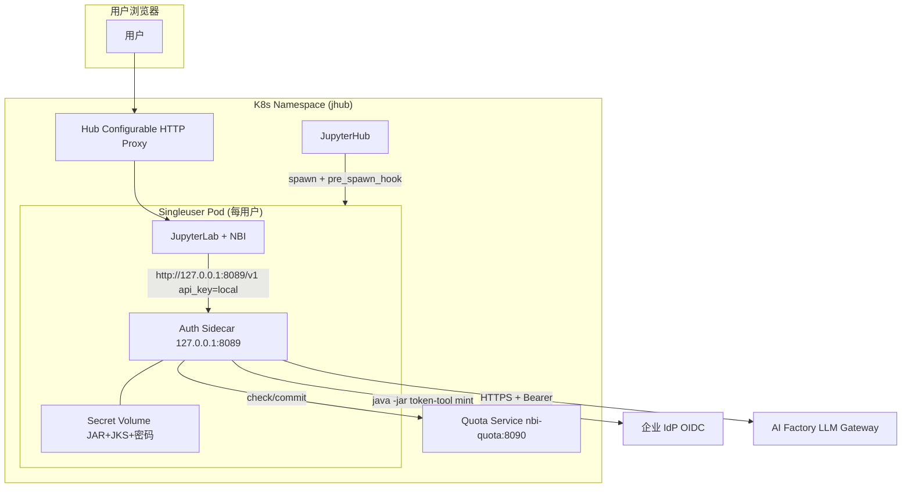

# Notebook Intelligence × AI Factory 生产集成详细实施方案

**Status:** Implementation guide aligned with in-repo spike under `../local-dev/`
**Date:** 2026-09-02
**Audience:** Platform / ML Platform / SecOps teams deploying on internal JupyterHub / Kubernetes

---

## 一、项目概览与架构决策

### 1.1 项目目标

在**内部 Kubernetes 上的 JupyterHub** 环境中，让 JupyterLab 用户通过 Notebook Intelligence (NBI) 使用企业内部 **AI Factory**（OpenAI 兼容网关，如 `databricks/gdp-gpt4o`）实现聊天、行内补全、Agent 等功能，**无需 GitHub Copilot**，并具备**按 Hub 用户粒度的配额计量与强制执行**能力。

### 1.2 核心架构决策（已通过 ADR）

> **不**在 NBI Python 进程中直接嵌入 Java JAR
> **不**让 NBI 直接调用 AI Factory

采用方案：**用户 Pod 内 Auth Sidecar + NBI 自带 `openai-compatible` Provider**

参考 ADR 文档：[adr-sidecar-vs-plugin.md](file:///Users/bl44001/gdp/repo/notebook-intelligence/local-dev/docs/adr-sidecar-vs-plugin.md)

### 1.3 生产架构全景



**请求时序：**

```text
1. Hub 登录 → pre_spawn_hook 注入 NBI_LLM_USER / GROUPS / PLAN → 启动 Sidecar
2. Sidecar 启动时预热 OIDC Token → /healthz 返回 token_warm=true
3. 用户发起 NBI 聊天 → NBI 调 Sidecar POST /v1/chat/completions (带 X-NBI-Feature)
4. Sidecar 调 Quota Service check → 超配额返回 429
5. 未超配额 → Sidecar 附加 Bearer Token 调 AI Factory → 获取响应 + usage
6. Sidecar 调 Quota Service commit tokens → 返回 OpenAI 格式响应给 NBI
```

**关键代码路径参考：**

- Sidecar 主进程：[sidecar.py](file:///Users/bl44001/gdp/repo/notebook-intelligence/local-dev/llm-gateway-sidecar/sidecar.py)
- Token Provider（mock/jar/static）：[token_provider.py](file:///Users/bl44001/gdp/repo/notebook-intelligence/local-dev/llm-gateway-sidecar/token_provider.py)
- Quota 服务：[server.py](file:///Users/bl44001/gdp/repo/notebook-intelligence/local-dev/quota_service/server.py)
- Hub spawn hook：[pre_spawn_hook.py](file:///Users/bl44001/gdp/repo/notebook-intelligence/local-dev/hub/pre_spawn_hook.py)
- Pod entrypoint：[entrypoint.sh](file:///Users/bl44001/gdp/repo/notebook-intelligence/local-dev/deploy/entrypoint.sh)

---

## 二、实施路线图（6 Phase 共约 2-3 周）

| Phase       | 内容                               | 耗时 | 交付物                               |
| ----------- | ---------------------------------- | ---- | ------------------------------------ |
| **Phase 0** | 准备工作 + 快速 Demo 验证（可选）  | 1 天 | Path A/B 聊天截图                    |
| **Phase 1** | 构建镜像 + 推送镜像仓库            | 2 天 | nbi-singleuser, nbi-quota 镜像       |
| **Phase 2** | 集群 Secret + Quota Service 部署   | 2 天 | Secret / ConfigMap / Quota Pod Ready |
| **Phase 3** | JupyterHub / KubeSpawner 配置对接  | 3 天 | Hub 配置合并 + 单用户冒烟            |
| **Phase 4** | NBI 默认配置 + 网络策略 + 代理绕过 | 2 天 | 零配置可用 + NetworkPolicy 验证      |
| **Phase 5** | 可观测性 + 运维 Runbook + 联调验收 | 3 天 | Grafana 仪表盘 + 验收矩阵通过        |

---

## 三、Phase 0 — 准备工作（必做）

### 3.1 获取企业依赖（最容易阻塞的环节，**并行发起**）

向以下团队发起资源请求，**切勿提交到 Git**：

| 团队                    | 需提供资源                                                                     | 用途                   |
| ----------------------- | ------------------------------------------------------------------------------ | ---------------------- |
| **Identity / Security** | `token-tool.jar`, `keystore.jks`, `aitruststore.jks`                           | OIDC Token Mint + mTLS |
| **Identity / Security** | Keystore / Truststore 密码                                                     | Sidecar 环境变量       |
| **Identity / Security** | `OIDC_TOKEN_URL`, `OIDC_CLIENT_CODE`, `OIDC_DOMAIN`                            | JAR 命令行参数         |
| **AI Factory 团队**     | `UPSTREAM_BASE_URL` (如 `https://gateway.scaifactory.dev.azure.scbdev.net/v1`) | 网关地址               |
| **AI Factory 团队**     | 模型 ID 列表 (如 `databricks/gdp-gpt4o`)                                       | NBI 默认模型           |
| **平台 / K8s**          | Hub 命名空间 kubectl 权限 + 镜像仓库 push 权限                                 | 部署验证               |
| **网络**                | IdP + AI Factory 出口白名单审批                                                | NetworkPolicy egress   |

### 3.2 本地环境确认

```bash
# 确认 Python 3.12+
conda activate nbi-jl45
cd /path/to/notebook-intelligence
./local-dev/python.sh --version   # 应为 3.12.x

# 运行本地回归（确保代码基线正确）
./local-dev/run-regression.sh
```

### 3.3 快速 Demo 验证（可选，1 天内完成）

若需快速证明可行性，先跑 Path A：

1. **从可连 AI Factory 的主机 Probe 网关能力**

```bash
cp local-dev/corp-probe.env.example local-dev/corp-probe.env
# 编辑 UPSTREAM_BASE_URL / UPSTREAM_API_KEY
set -a && source local-dev/corp-probe.env && set +a
./local-dev/probe-gateway.sh
./local-dev/merge-probe-into-matrix.sh
```

2. **已有 Hub + NBI 时，在 NBI Settings 直接配置**
   - Provider: `openai-compatible`
   - Base URL: `https://<ai-factory-host>/v1`
   - API Key: 当前 OIDC Bearer Token
   - Model: `databricks/gdp-gpt4o`
   - **注意 `NO_PROXY` 必须包含网关域名**（见 §5.3）

Demo 完成后务必删除 Settings 中的明文 API Key，然后切换到生产 Sidecar 方案。

---

## 四、Phase 1 — 构建镜像并推送仓库

### 4.1 构建两个关键镜像

从仓库根目录执行：

```bash
cd /Users/bl44001/gdp/repo/notebook-intelligence

# 配置变量
export NS=jhub
export REGISTRY=registry.example.com/nbi
export TAG=20260902-1

# 一键构建
TAG=$TAG ./local-dev/deploy/build-images.sh
# 输出：nbi-singleuser:$TAG, nbi-quota:$TAG
```

构建脚本：[build-images.sh](file:///Users/bl44001/gdp/repo/notebook-intelligence/local-dev/deploy/build-images.sh)

### 4.2 Singleuser 镜像说明（生产环境必看）

Dockerfile：[Dockerfile.singleuser](file:///Users/bl44001/gdp/repo/notebook-intelligence/local-dev/deploy/Dockerfile.singleuser)

**生产改造要点：**

- 将 `BASE_IMAGE` 替换为你们现有的 Hub singleuser 基础镜像（必须已包含 JupyterLab 4.x + NBI 扩展）
- **在镜像中安装 JRE**（`TOKEN_PROVIDER=jar` 必须）：

  ```dockerfile
  USER root
  RUN apt-get update && apt-get install -y openjdk-17-jre-headless && rm -rf /var/lib/apt/lists/*
  ```

- 通过 Hub **环境变量覆盖** `MODE=proxy`，不要写死在镜像 ENV 里（方便 dig 回退到 mock）
- NBI baked config 已在镜像构建阶段复制到 `${CONDA_DIR}/share/jupyter/nbi/config.json`，**来源**：[nbi-config.local.json](file:///Users/bl44001/gdp/repo/notebook-intelligence/local-dev/nbi-config.local.json)

### 4.3 推送镜像

```bash
docker tag nbi-singleuser:$TAG  ${REGISTRY}/nbi-singleuser:${TAG}
docker tag nbi-quota:$TAG       ${REGISTRY}/nbi-quota:${TAG}
docker push ${REGISTRY}/nbi-singleuser:${TAG}
docker push ${REGISTRY}/nbi-quota:${TAG}
```

### 4.4 镜像冒烟测试

```bash
# 本地启动 sidecar 镜像
docker run --rm -e MODE=mock -p 8089:8089 --entrypoint python \
  ${REGISTRY}/nbi-singleuser:${TAG} \
  /opt/nbi-local-dev/llm-gateway-sidecar/sidecar.py &
sleep 3
curl -sS http://127.0.0.1:8089/healthz
# 期望 {"status":"ok",...}
kill %1
```

---

## 五、Phase 2 — 集群 Secret 与 Quota Service 部署

### 5.1 从 JKS 提取企业 CA PEM（推荐方式，避免 verify=False）

```bash
cd /path/to/notebook-intelligence

# 执行 CA 提取脚本
TRUSTSTORE_PATH=./aitruststore.jks TRUSTSTORE_PASSWORD='***' \
  ./local-dev/extract-ca-from-jks.sh
# 输出：local-dev/.runtime/corp-ca-bundle.pem

# 验证 PEM 内容
openssl x509 -in local-dev/.runtime/corp-ca-bundle.pem -text -noout | head -20
```

### 5.2 创建 K8s Secret `nbi-llm-auth`

**切勿把 JAR/JKS/密码放入 Git**，使用 kubectl 直接创建：

```bash
export NS=jhub
kubectl get ns "$NS" || kubectl create namespace "$NS"

kubectl -n "$NS" create secret generic nbi-llm-auth \
  --from-file=token-tool.jar=./token-tool.jar \
  --from-file=keystore.jks=./keystore.jks \
  --from-file=truststore.jks=./aitruststore.jks \
  --from-file=corp-ca.pem=local-dev/.runtime/corp-ca-bundle.pem \
  --from-literal=KEYSTORE_PASSWORD='***' \
  --from-literal=TRUSTSTORE_PASSWORD='***' \
  --from-literal=OIDC_TOKEN_URL='https://idp.example.com/.../token' \
  --from-literal=OIDC_CLIENT_CODE='your-client-code' \
  --from-literal=OIDC_DOMAIN='mydomain'

# 验证 secret 存在
kubectl -n "$NS" get secret nbi-llm-auth -o json | jq '.data | keys'
```

Manifest 模板参考：[secret-llm-auth.example.yaml](file:///Users/bl44001/gdp/repo/notebook-intelligence/local-dev/deploy/k8s/secret-llm-auth.example.yaml)

### 5.3 配置并部署 Quota Service

**(1) 自定义配额计划（按组织需求）**

编辑：[plans.json](file:///Users/bl44001/gdp/repo/notebook-intelligence/local-dev/quota_service/plans.json)

```json
{
  "plans": {
    "intern": {
      "id": "intern",
      "tokens_per_day": 200000,
      "requests_per_day": 200,
      "models": ["databricks/gdp-gpt4o"]
    },
    "standard": {
      "id": "standard",
      "tokens_per_day": 2000000,
      "requests_per_day": 2000,
      "models": ["databricks/gdp-gpt4o"]
    },
    "power": {
      "id": "power",
      "tokens_per_day": 20000000,
      "requests_per_day": 20000,
      "models": ["databricks/gdp-gpt4o", "databricks/gdp-gpt4o-large"]
    }
  },
  "group_rules": {
    "interns": "intern",
    "ml-platform": "power"
  }
}
```

**(2) 通过 ConfigMap 挂载 plans** 或直接修改 plans.json 后重新构建 quota 镜像。

**(3) 一键部署 Quota Service 及相关 Manifests：**

```bash
export NS=jhub
export REGISTRY=registry.example.com/nbi
export TAG=20260902-1
# 编辑 quota-service.yaml 中的 image 字段
NS="$NS" ./local-dev/deploy/apply-manifests.sh --apply
```

Quota Service 部署清单：[quota-service.yaml](file:///Users/bl44001/gdp/repo/notebook-intelligence/local-dev/deploy/k8s/quota-service.yaml)
应用脚本：[apply-manifests.sh](file:///Users/bl44001/gdp/repo/notebook-intelligence/local-dev/deploy/apply-manifests.sh)

**(4) 验证 Quota Service：**

```bash
kubectl -n "$NS" get pods -l app=nbi-quota
kubectl -n "$NS" port-forward svc/nbi-quota 8090:8090 &

# 健康检查
curl -sS http://127.0.0.1:8090/healthz
# 期望：{"status":"ok"}

# Plan 解析
curl -sS -X POST http://127.0.0.1:8090/v1/plans/resolve \
  -H 'Content-Type: application/json' \
  -d '{"username":"alice","groups":["interns"]}'
# 期望返回 intern 计划详情

kill %1  # 停止 port-forward
```

### 5.4 生产 Quota 数据持久化

- **Dev/Dig**：可使用 `emptyDir`（重启丢失，可接受）
- **Production**：必须为 Quota Service 挂载 PVC 到 `/var/lib/nbi-quota`（或改用 Redis/Postgres 作为后端，当前代码用 JSON 文件存储）

---

## 六、Phase 3 — JupyterHub / KubeSpawner 配置对接

### 6.1 合并 Hub 配置片段

将以下文件的逻辑合并到你们现有的 Hub 配置：

- Snippet 参考：[jupyterhub_config.snippet.py](file:///Users/bl44001/gdp/repo/notebook-intelligence/local-dev/hub/jupyterhub_config.snippet.py)
- Spawn Hook：[pre_spawn_hook.py](file:///Users/bl44001/gdp/repo/notebook-intelligence/local-dev/hub/pre_spawn_hook.py)

**完整生产配置示例：**

```python
# ===== jupyterhub_config.py — AI Factory 集成片段 =====
c = get_config()

import os
import sys

# pre_spawn_hook 随 Hub 镜像一起发布，或通过 ConfigMap 挂载
sys.path.insert(0, "/opt/nbi-local-dev/hub")
from pre_spawn_hook import make_pre_spawn_hook

QUOTA_URL = "http://nbi-quota.jhub.svc.cluster.local:8090"
AI_FACTORY = "https://gateway.scaifactory.dev.azure.scbdev.net/v1"

# ============ 1. Spawn Hook 注入身份和配额计划 ============
c.KubeSpawner.pre_spawn_hook = make_pre_spawn_hook(quota_service_url=QUOTA_URL)

# ============ 2. 镜像和入口点 ============
c.KubeSpawner.image = "registry.example.com/nbi/nbi-singleuser:20260902-1"
c.KubeSpawner.cmd = ["/opt/nbi-local-dev/deploy/entrypoint.sh"]

# ============ 3. 企业代理绕过（Zscaler / HTTPS_PROXY） ============
_no_proxy_extra = (
    "gateway.scaifactory.dev.azure.scbdev.net,"
    ".scaifactory.dev.azure.scbdev.net,"
    ".azure.scbdev.net,"
    "nbi-quota.jhub.svc.cluster.local,"
    ".jhub.svc.cluster.local,"
    ".svc.cluster.local,"
    "127.0.0.1,localhost"
)
_existing_no_proxy = os.environ.get("NO_PROXY", "")
_merged_no_proxy = ",".join(
    x for x in (_existing_no_proxy + "," + _no_proxy_extra).split(",") if x
)

# ============ 4. Pod 环境变量注入 ============
c.KubeSpawner.environment.update({
    # --- Sidecar 模式 ---
    "MODE": "proxy",
    "TOKEN_PROVIDER": "jar",
    "TOKEN_JAR": "/var/run/nbi-llm-auth/token-tool.jar",
    "KEYSTORE_PATH": "/var/run/nbi-llm-auth/keystore.jks",
    "TRUSTSTORE_PATH": "/var/run/nbi-llm-auth/truststore.jks",
    "JAVA_BIN": "java",
    "HOST": "127.0.0.1",
    "PORT": "8089",
    # --- 上游 AI Factory ---
    "UPSTREAM_BASE_URL": AI_FACTORY,
    "UPSTREAM_VERIFY_TLS": "1",  # 生产保持 1，绝不使用 0
    # --- CA 信任 ---
    "SSL_CERT_FILE": "/var/run/nbi-llm-auth/corp-ca.pem",
    "REQUESTS_CA_BUNDLE": "/var/run/nbi-llm-auth/corp-ca.pem",
    # --- Quota ---
    "QUOTA_BACKEND": "http",
    "QUOTA_SERVICE_URL": QUOTA_URL,
    "NBI_LLM_SIDECAR_URL": "http://127.0.0.1:8089",
    # --- NBI Provider 锁定（强制使用 sidecar） ---
    "NBI_CHAT_MODEL_PROVIDER": "openai-compatible",
    "NBI_CHAT_MODEL_ID": "openai-compatible-chat-model",
    "NBI_INLINE_COMPLETION_MODEL_PROVIDER": "openai-compatible",
    "NBI_INLINE_COMPLETION_MODEL_ID": "openai-compatible-inline-completion-model",
    # --- 禁用不安全的功能（按安全要求） ---
    "NBI_CLAUDE_BYPASS_PERMISSIONS_POLICY": "force-off",
    # --- 代理绕过（大小写都要设）---
    "NO_PROXY": _merged_no_proxy,
    "no_proxy": _merged_no_proxy,
})

# ============ 5. Secret Volume 挂载 ============
c.KubeSpawner.volumes = [
    {
        "name": "nbi-llm-auth",
        "secret": {
            "secretName": "nbi-llm-auth",
            "defaultMode": 0o400,  # 只读，仅限 owner 读
        },
    },
]
c.KubeSpawner.volume_mounts = [
    {
        "name": "nbi-llm-auth",
        "mountPath": "/var/run/nbi-llm-auth",
        "readOnly": True,
    },
]

# ============ 6. 密码 env 注入（优先 envFrom） ============
# 如果 KubeSpawner 支持 envFrom，直接引用：
c.KubeSpawner.extra_container_config = {
    "envFrom": [
        {"secretRef": {"name": "nbi-llm-auth"}},
    ],
}
# 否则通过 spawner.environment 显式读取 secretKeyRef
```

### 6.2 pre_spawn_hook 行为说明

Hook 在**每次 spawn / resume** 时执行，注入以下 env：

| Env 变量                   | 来源                                          | 说明                       |
| -------------------------- | --------------------------------------------- | -------------------------- |
| `NBI_LLM_USER`             | Hub `spawner.user.name`（小写，去邮箱域名）   | 计量主体                   |
| `NBI_LLM_GROUPS`           | Hub 用户组列表（逗号分隔）                    | 计划解析依据               |
| `NBI_LLM_PLAN`             | Quota Service resolve 结果（或本地 fallback） | UI 展示用 hint，不是权威值 |
| `NBI_LLM_QUOTA_TOKENS_DAY` | 计划 tokens_per_day                           | 调试用 hint                |
| `NBI_LLM_QUOTA_REQ_DAY`    | 计划 requests_per_day                         | 调试用 hint                |
| `QUOTA_BACKEND`            | `http`（当配置了 quota_service_url 时）       | Sidecar 使用 HTTP Quota    |
| `QUOTA_SERVICE_URL`        | 传入的 URL                                    | 实际调用地址               |

**关键原则：** Quota 强制执行永远在 Quota Service 端重新解析计划，用户不可通过修改 pod env 提升限额。

### 6.3 Zero-to-JupyterHub Helm Values 对照（若用 Helm）

```yaml
singleuser:
  image:
    name: registry.example.com/nbi/nbi-singleuser
    tag: 20260902-1
  cmd:
    - /opt/nbi-local-dev/deploy/entrypoint.sh
  extraEnv:
    MODE: proxy
    TOKEN_PROVIDER: jar
    TOKEN_JAR: /var/run/nbi-llm-auth/token-tool.jar
    KEYSTORE_PATH: /var/run/nbi-llm-auth/keystore.jks
    TRUSTSTORE_PATH: /var/run/nbi-llm-auth/truststore.jks
    UPSTREAM_BASE_URL: https://gateway.scaifactory.dev.azure.scbdev.net/v1
    UPSTREAM_VERIFY_TLS: '1'
    SSL_CERT_FILE: /var/run/nbi-llm-auth/corp-ca.pem
    REQUESTS_CA_BUNDLE: /var/run/nbi-llm-auth/corp-ca.pem
    QUOTA_BACKEND: http
    QUOTA_SERVICE_URL: http://nbi-quota.jhub.svc.cluster.local:8090
    NBI_LLM_SIDECAR_URL: http://127.0.0.1:8089
    NBI_CHAT_MODEL_PROVIDER: openai-compatible
    NBI_CHAT_MODEL_ID: openai-compatible-chat-model
    NBI_INLINE_COMPLETION_MODEL_PROVIDER: openai-compatible
    NBI_INLINE_COMPLETION_MODEL_ID: openai-compatible-inline-completion-model
    # 合并现有 NO_PROXY，不要覆盖
    NO_PROXY: '127.0.0.1,localhost,.svc,.cluster.local,gateway.scaifactory.dev.azure.scbdev.net,.scaifactory.dev.azure.scbdev.net,.azure.scbdev.net'
    no_proxy: '127.0.0.1,localhost,.svc,.cluster.local,gateway.scaifactory.dev.azure.scbdev.net,.scaifactory.dev.azure.scbdev.net,.azure.scbdev.net'
  storage:
    extraVolumes:
      - name: nbi-llm-auth
        secret:
          secretName: nbi-llm-auth
          defaultMode: 0400
    extraVolumeMounts:
      - name: nbi-llm-auth
        mountPath: /var/run/nbi-llm-auth
        readOnly: true

hub:
  extraConfig:
    00-nbi-pre-spawn: |
      import sys
      sys.path.insert(0, "/opt/nbi-local-dev/hub")
      from pre_spawn_hook import make_pre_spawn_hook
      c.KubeSpawner.pre_spawn_hook = make_pre_spawn_hook(
          quota_service_url="http://nbi-quota.jhub.svc.cluster.local:8090"
      )
```

### 6.4 单用户冒烟（首次部署必做）

```bash
# 找出用户 Pod
kubectl -n "$NS" get pods -l component=singleuser-server

POD=jupyter-alice
# 在 Pod 内验证 sidecar
kubectl -n "$NS" exec -it "$POD" -- bash -lc '
  echo "=== healthz ==="
  curl -sS http://127.0.0.1:8089/healthz
  echo -e "\n=== quota ==="
  curl -sS http://127.0.0.1:8089/quota | python -m json.tool
  echo -e "\n=== env (验证关键变量) ==="
  env | grep -E "^(MODE|TOKEN|UPSTREAM|NBI_|QUOTA_|NO_PROXY)" | sort
'
```

期望：

- `/healthz` 返回 `token_warm: true`
- `/quota` 返回 `user_id: alice`（Hub 用户名）
- env 中有 `MODE=proxy`, `TOKEN_PROVIDER=jar`

---

## 七、Phase 4 — NBI 默认配置 + 网络策略 + 代理绕过

### 7.1 NBI Baked Config（零用户配置）

镜像已默认配置：[nbi-config.local.json](file:///Users/bl44001/gdp/repo/notebook-intelligence/local-dev/nbi-config.local.json)

```json
{
  "chat_model": {
    "provider": "openai-compatible",
    "model": "openai-compatible-chat-model",
    "properties": [
      { "id": "api_key", "value": "local", "optional": false },
      { "id": "model_id", "value": "databricks/gdp-gpt4o", "optional": false },
      {
        "id": "base_url",
        "value": "http://127.0.0.1:8089/v1",
        "optional": true
      },
      { "id": "context_window", "value": "128000", "optional": true }
    ]
  },
  "inline_completion_model": {
    "provider": "openai-compatible",
    "model": "openai-compatible-inline-completion-model",
    "properties": [
      { "id": "api_key", "value": "local", "optional": false },
      { "id": "model_id", "value": "databricks/gdp-gpt4o", "optional": false },
      {
        "id": "base_url",
        "value": "http://127.0.0.1:8089/v1",
        "optional": true
      },
      { "id": "context_window", "value": "128000", "optional": true }
    ]
  }
}
```

**验证目标：** 全新 PVC 用户打开 JupyterLab → 打开 NBI 聊天 → 直接发送消息，**不需要点击任何 Settings**。

### 7.2 禁用 Copilot 等 Provider（安全合规）

生产 `jupyter_server_config.py` 配置：[jupyter_server_config.py](file:///Users/bl44001/gdp/repo/notebook-intelligence/local-dev/jupyter_server_config.py)

```python
c = get_config()
c.NotebookIntelligence.disabled_providers = [
    "github-copilot",      # 内网不可达，策略要求只用内部模型
    "ollama",              # 本地模型，不允许
    "litellm-compatible",  # 只用 openai-compatible 走 sidecar
]
# 禁止用户通过 env 重新启用（安全场景）
c.NotebookIntelligence.allow_enabling_providers_with_env = False

# （可选）禁用高权限工具
c.NotebookIntelligence.disabled_tools = [
    # "nbi-command-execute",  # 根据安全要求可选禁用
]
```

### 7.3 企业代理 / Zscaler 处理（**企业集群 90% 的连接问题源于此**）

#### 现象

```
NBI 报错：Connection error
curl 报错：Zscaler/502 Bad Gateway after CONNECT
```

#### 根因

用户 Pod 默认 `HTTPS_PROXY=http://zscaler-ip:443`，但 AI Factory 是**内部服务**，走 Zscaler CONNECT 会 502。

#### 解决方案

**在 Hub 的 KubeSpawner.environment 中设置 `NO_PROXY` 和 `no_proxy`（两者都必须），必须包含：**

```
gateway.scaifactory.dev.azure.scbdev.net
.scaifactory.dev.azure.scbdev.net
.azure.scbdev.net
<企业 IdP 域名>
nbi-quota.jhub.svc.cluster.local
.svc.cluster.local
127.0.0.1
localhost
```

#### 验证（用户 Pod 内执行）：

```bash
# 在用户 Pod 终端内
python - <<'PY'
import os
np = (os.environ.get("NO_PROXY") or "") + "," + (os.environ.get("no_proxy") or "")
print("AI Factory on NO_PROXY?",
      "scaifactory" in np or "azure.scbdev.net" in np)
print("HTTPS_PROXY=", os.environ.get("HTTPS_PROXY") or os.environ.get("https_proxy"))
PY

# 直接 curl 验证走直连（不走 Zscaler）
curl -v --connect-timeout 10 \
  "https://gateway.scaifactory.dev.azure.scbdev.net/v1/chat/completions" \
  -H "Authorization: Bearer <VALID_TOKEN>" \
  -H "Content-Type: application/json" \
  -d '{"model":"databricks/gdp-gpt4o","messages":[{"role":"user","content":"ping"}],"max_tokens":16}'
# 成功标志：Connected to <私有IP> 不是 Zscaler IP，HTTP 200
```

**关键：修改 NO_PROXY 后必须 **Stop My Server → Start My Server\*\*（终端 export 不会更新已运行的 Jupyter Server 进程）。

### 7.4 NetworkPolicy 部署（阻止 Notebook 直连 Gateway）

目的：Notebook 代码（Python/Shell）**不能绕过 Sidecar 直接调用 AI Factory**，确保所有请求都经过 Sidecar 计量。

清单：[networkpolicy-llm-egress.yaml](file:///Users/bl44001/gdp/repo/notebook-intelligence/local-dev/deploy/k8s/networkpolicy-llm-egress.yaml)

```bash
# 部署前先把 ipBlock CIDRs 收紧到 IdP + AI Factory 的真实 CIDR
# （当前示例可能是 0.0.0.0/0，生产必须改为具体 CIDR）
vim local-dev/deploy/k8s/networkpolicy-llm-egress.yaml

kubectl -n "$NS" apply -f local-dev/deploy/k8s/networkpolicy-llm-egress.yaml
```

**验收：**

```bash
# 进入用户 Pod Notebook Terminal 或 Notebook Cell：
curl -v --connect-timeout 5 "https://gateway.scaifactory.dev.azure.scbdev.net/v1/models"
# 期望：超时或连接拒绝（NetworkPolicy 生效）

# 但 Sidecar 仍可以（同一 Pod 网络命名空间，Sidecar 进程不受 NetworkPolicy 影响）：
curl -sS "http://127.0.0.1:8089/healthz"
# 期望正常返回
```

> **说明：** 本指南采用 entrypoint 协进程模型（Sidecar 和 Jupyter 在同一容器），NetworkPolicy 针对 Pod 生效。如果采用多容器 Sidecar 模式，需仔细配置 NetworkPolicy 使 Sidecar 容器可 egress，而 Notebook 所在容器不可。

---

## 八、Phase 5 — 可观测性 + 运维 + 联调验收

### 8.1 Sidecar 运营端点

用户 Pod 内 Sidecar（127.0.0.1:8089）暴露：

| 路径                        | 用途                             |
| --------------------------- | -------------------------------- |
| `GET /healthz`              | 存活 + Token 预热状态            |
| `GET /quota`                | 当前用户剩余额度 / 计划 / 软上限 |
| `GET /metrics`              | Prometheus 文本格式              |
| `GET /v1/models`            | 静态模型列表                     |
| `POST /v1/chat/completions` | 代理请求（NBI 调用）             |

NBI 前端配额徽章路径：

```text
浏览器 → GET /notebook-intelligence/llm-quota
       → Jupyter Server (NBI extension.py)
       → http://127.0.0.1:8089/quota
```

对应代码：[extension.py](file:///Users/bl44001/gdp/repo/notebook-intelligence/notebook_intelligence/extension.py) 中的 `llm-quota` 路由，[chat-sidebar.tsx](file:///Users/bl44001/gdp/repo/notebook-intelligence/src/chat-sidebar.tsx) 中的徽章和横幅。

### 8.2 Prometheus + Grafana 部署

```bash
# (可选) 如果使用 Prometheus Operator
kubectl -n "$NS" apply -f local-dev/deploy/k8s/servicemonitor-sidecar.example.yaml

# Prometheus Alert Rules
kubectl -n monitoring apply -f local-dev/deploy/prometheus/alerts-nbi-llm.yml
# 文件位置：alerts-nbi-llm.yml

# Grafana 仪表盘
# 导入 JSON：nbi-llm-sidecar-dashboard.json
```

**指标采集注意事项：**

- Dig/Staging：用 `kubectl exec` + `curl 127.0.0.1:8089/metrics` 手工验证即可
- Production：每用户 Pod Sidecar 监听 loopback，Prometheus 无法直接 scrape。方案：
  - Pushgateway：Sidecar 推送到中心 Pushgateway
  - Hub 侧聚合器：按计划批量 `kubectl exec` 拉取
  - 改用 DaemonSet Node-Exporter + 自定义脚本

### 8.3 Usage 报表导出

```bash
# 导出 CSV 报表
./local-dev/export-usage.sh --summary

# 集群 CronJob（每日/每周自动导出）
kubectl -n "$NS" apply -f local-dev/deploy/k8s/usage-export-cronjob.yaml
```

### 8.4 Runbook 链接 + 桌面演练

- **Runbook（运维操作手册）：** [runbook.md](file:///Users/bl44001/gdp/repo/notebook-intelligence/local-dev/docs/runbook.md)
  - 包含：429 配额超额急救、Break-glass 临时启用 Copilot、密码轮换、故障排查树
- **桌面演练脚本（Staging 执行一次）：**

```bash
./local-dev/tabletop-chaos.sh
# 模拟：Token 过期 / Quota Service 不可用 / Sidecar 重启
```

### 8.5 最终验收矩阵（Go-Live 前必须全通过）

参考：[go-live-checklist.md](file:///Users/bl44001/gdp/repo/notebook-intelligence/local-dev/docs/go-live-checklist.md) 和 [hub-evidence-checklist.md](file:///Users/bl44001/gdp/repo/notebook-intelligence/local-dev/docs/hub-evidence-checklist.md)

| #   | 检查项                                    | 期望结果                                                 | 证据形式        |
| --- | ----------------------------------------- | -------------------------------------------------------- | --------------- |
| 1   | `curl 127.0.0.1:8089/healthz`             | `status=ok`, `token_warm=true`                           | 截图            |
| 2   | NBI 聊天（新 PVC 用户，零 Settings 点击） | 流式/完整回复，无 GitHub 登录                            | 录屏/截图       |
| 3   | `/quota` endpoint                         | `user_id` = Hub 用户名                                   | 截图            |
| 4   | 两组不同用户（interns vs ml-platform）    | 返回不同 `limit_tokens`                                  | 截图对比        |
| 5   | 超额测试（临时调低计划或 boost 负值）     | HTTP 429；聊天显示计划+重置时间；Lab 其他功能正常        | 截图            |
| 6   | OIDC Token 刷新（短 TTL 测试）            | 过期后仍可聊天，无需手动干预                             | Log + 聊天截图  |
| 7   | 全新 PVC 用户                             | 不打开 Settings 面板直接聊天                             | 录屏            |
| 8   | NetworkPolicy 验证                        | Notebook 里 curl Gateway **失败**；Sidecar curl **成功** | 命令结果        |
| 9   | NO_PROXY 验证                             | AI Factory 域名存在；无 Zscaler 502                      | env + curl 输出 |
| 10  | Sidecar 绑定                              | `netstat -tlnp` 只监听 127.0.0.1 不是 0.0.0.0            | 命令结果        |

---

## 九、已知限制与生产改造清单

| 限制项                            | 严重度 | 说明                                                                            | 建议行动                                                                                                                            |
| --------------------------------- | ------ | ------------------------------------------------------------------------------- | ----------------------------------------------------------------------------------------------------------------------------------- |
| **Proxy Mode SSE 流式**           | 中     | 当前 sidecar 使用 `urlopen` 缓冲完整响应，不是真正流式透传（Mock 模式流式正常） | Go-live 前用 `probe-gateway.sh` 验证流式体验，如不足需修改 sidecar 实现 chunked SSE 透传                                            |
| **Agent Mode / Tool Calling**     | 高     | 默认保持关闭                                                                    | 等 `feature-matrix.md` Corp 列 `tool_calls_observed=true` 后再启用                                                                  |
| **Quota 存储**                    | 中     | 当前 Quota Service 使用 JSON 文件存储（单文件写入非并发安全）                   | Production 切换到 Redis / Postgres 后端                                                                                             |
| **NBI*LLM_QUOTA*\* env**          | 低     | 是 UX hint，不是权威值                                                          | 文档中明确说明，避免误将这些值当权威                                                                                                |
| **Custom NBI Plugin**             | 低     | ADR 已推迟（S20）                                                               | 除非策略禁止 Sidecar，否则不构建                                                                                                    |
| **Central Gateway Per-User Keys** | 低     | 推迟（S21，见 ADR）                                                             | 参考 [adr-central-gateway-keys.md](file:///Users/bl44001/gdp/repo/notebook-intelligence/local-dev/docs/adr-central-gateway-keys.md) |

---

## 十、关键环境变量速查表

### Sidecar（Pod env 注入）

| 变量                                                  | 生产值                                                | 说明                                  |
| ----------------------------------------------------- | ----------------------------------------------------- | ------------------------------------- |
| `MODE`                                                | `proxy`                                               | mock=本地回显 / proxy=真实 AI Factory |
| `TOKEN_PROVIDER`                                      | `jar`                                                 | mock / jar / static                   |
| `TOKEN_JAR`                                           | `/var/run/nbi-llm-auth/token-tool.jar`                | 来自 Secret                           |
| `KEYSTORE_PATH`                                       | `/var/run/nbi-llm-auth/keystore.jks`                  | 来自 Secret                           |
| `TRUSTSTORE_PATH`                                     | `/var/run/nbi-llm-auth/truststore.jks`                | 来自 Secret                           |
| `KEYSTORE_PASSWORD`                                   | _(from secret)_                                       | envFrom Secret                        |
| `TRUSTSTORE_PASSWORD`                                 | _(from secret)_                                       | envFrom Secret                        |
| `OIDC_TOKEN_URL` / `OIDC_CLIENT_CODE` / `OIDC_DOMAIN` | _(from secret)_                                       | JAR 参数                              |
| `UPSTREAM_BASE_URL`                                   | `https://gateway.scaifactory.dev.azure.scbdev.net/v1` | AI Factory 网关                       |
| `UPSTREAM_VERIFY_TLS`                                 | `1`                                                   | 生产绝不为 0                          |
| `SSL_CERT_FILE` / `REQUESTS_CA_BUNDLE`                | `/var/run/nbi-llm-auth/corp-ca.pem`                   | 企业 CA PEM                           |
| `HOST` / `PORT`                                       | `127.0.0.1` / `8089`                                  | 只监听 loopback                       |
| `QUOTA_BACKEND`                                       | `http`                                                | local / http                          |
| `QUOTA_SERVICE_URL`                                   | `http://nbi-quota.jhub.svc.cluster.local:8090`        | 集群内地址                            |
| `NBI_LLM_USER`                                        | _(from pre_spawn_hook)_                               | Hub 用户名                            |
| `NBI_LLM_GROUPS`                                      | _(from pre_spawn_hook)_                               | 逗号分隔组                            |
| `NBI_LLM_SIDECAR_URL`                                 | `http://127.0.0.1:8089`                               | NBI 侧配额代理                        |
| `NO_PROXY` / `no_proxy`                               | _(AI Factory + IdP + 集群)_                           | 绕过 Zscaler                          |

### NBI（强制锁定，用户不可改）

| 变量                                   | 值                                          | 说明                 |
| -------------------------------------- | ------------------------------------------- | -------------------- |
| `NBI_CHAT_MODEL_PROVIDER`              | `openai-compatible`                         | 锁定 Provider        |
| `NBI_CHAT_MODEL_ID`                    | `openai-compatible-chat-model`              | 锁定 Chat Model      |
| `NBI_INLINE_COMPLETION_MODEL_PROVIDER` | `openai-compatible`                         | 锁定 Inline Provider |
| `NBI_INLINE_COMPLETION_MODEL_ID`       | `openai-compatible-inline-completion-model` | 锁定 Inline Model    |
| `NBI_CLAUDE_BYPASS_PERMISSIONS_POLICY` | `force-off`                                 | 安全默认             |

---

## 十一、利益相关方与交付协同

| 角色团队                | 需交付 / 需协作                                                                |
| ----------------------- | ------------------------------------------------------------------------------ |
| **Platform / K8s**      | Singleuser 镜像构建流水线、Hub 配置合并权限、NetworkPolicy 部署、镜像仓库 Push |
| **Identity / Security** | JAR + JKS + 密码、密码轮换策略、企业 CA PEM                                    |
| **AI Factory 团队**     | 网关 URL、模型列表、流式/工具调用能力矩阵、SLA                                 |
| **Quota / FinOps**      | 计划目录 rules、报表存储位置、boost 审批流程                                   |
| **Monitoring**          | Prometheus/Grafana 租户、告警路由配置                                          |
| **NBI 集成侧**          | Baked config、Provider 锁定、错误 UX + 配额 UI                                 |

---

## 十二、失败场景快速排障

| 现象                                             | 可能原因                             | 第一动作                                                                     |
| ------------------------------------------------ | ------------------------------------ | ---------------------------------------------------------------------------- |
| NBI 聊天报错 `Connection error` + OpenAI retries | NO_PROXY 未设置导致 Zscaler 502      | 用户 Pod 终端 `echo $NO_PROXY` → 检查是否含网关域名 → 重启 Server            |
| 聊天报 `429 quota exceeded`                      | 用户配额耗尽                         | `curl 127.0.0.1:8089/quota` → Quota Service `PUT /v1/quota/{user}` boost     |
| `/healthz` 返回 503 `token_warm=false`           | JAR/IdP/keystore 问题                | `kubectl logs <pod> sidecar.log` / `/opt/nbi-local-dev/.runtime/sidecar.log` |
| Inline completion 无反应也无报错                 | 设计行为（429 静默失败）             | 检查 Sidecar metrics `denials_total`                                         |
| NBI Settings 仍出现 GitHub Copilot               | `disabled_providers` traitlet 未生效 | 检查 `jupyter_server_config.py` 路径                                         |
| 用户能从 Notebook 直接 curl Gateway              | NetworkPolicy 未应用或 CIDR 过宽     | `kubectl get networkpolicy -n jhub` → 重新 apply 收紧 CIDR                   |
| `/v1/models` 返回 404                            | AI Factory 未实现 Models API         | **正常，不影响**，直接验证 `POST /v1/chat/completions` 即可                  |

---

## 文档索引（阅读优先级）

1. **生产 K8s 部署指南（核心参考）：** [ai-factory-k8s-deployment.md](file:///Users/bl44001/gdp/repo/notebook-intelligence/docs/ai-factory-k8s-deployment.md)
2. **项目 Handoff：** [handoff-internal-llm-gateway.md](file:///Users/bl44001/gdp/repo/notebook-intelligence/docs/handoff-internal-llm-gateway.md)
3. **需求与架构规格：** [internal-llm-gateway-integration.md](file:///Users/bl44001/gdp/repo/notebook-intelligence/docs/internal-llm-gateway-integration.md)
4. **用户故事与完成状态：** [internal-llm-gateway-stories.md](file:///Users/bl44001/gdp/repo/notebook-intelligence/docs/internal-llm-gateway-stories.md)
5. **Go-Live 检查清单：** [go-live-checklist.md](file:///Users/bl44001/gdp/repo/notebook-intelligence/local-dev/docs/go-live-checklist.md)
6. **运维 Runbook：** [runbook.md](file:///Users/bl44001/gdp/repo/notebook-intelligence/local-dev/docs/runbook.md)
7. **NBI 管理员指南：** [admin-guide.md](file:///Users/bl44001/gdp/repo/notebook-intelligence/docs/admin-guide.md)
8. **快速 Demo 指南：** [ai-factory-quick-demo.md](file:///Users/bl44001/gdp/repo/notebook-intelligence/docs/ai-factory-quick-demo.md)

---

## 总结

集成核心可概括为 **"1 镜像 + 1 服务 + 1 Secret + 1 Hook"**：

1. **1 个 Singleuser 镜像**：NBI + JRE + Sidecar 代码 + Entrypoint 协同启动
2. **1 个集群 Quota Service**：统一管理配额计划、计量计数、急救 boost
3. **1 个 `nbi-llm-auth` Secret**：JAR/JKS/密码/CA PEM 统一挂载，永不进 Git
4. **1 个 `pre_spawn_hook`**：Hub 登录身份 → NBI*LLM*\* 环境变量，实现零二次登录

NBI 本身几乎零改动——仅使用自带 `openai-compatible` Provider 指向 `http://127.0.0.1:8089/v1`，API Key 填假值 `local`（真实 Bearer 由 Sidecar 注入）。最常见的失败原因是 **Zscaler / HTTPS_PROXY 未绕过** 和 **NetworkPolicy 未正确收敛**。

遵循以上 Phase 0–5 步骤，约 2-3 周可完成生产级集成与验收。
