# Notebook Intelligence × AI Factory — Confluence Page

> **How to publish on Confluence**
>
> 1. Create a blank page (or import Markdown if your space supports it).
> 2. Paste each section as headings / tables / code blocks.
> 3. For diagrams: insert a **Mermaid** macro (or Markdown Mermaid block if enabled) and paste the fenced `mermaid` content below.
> 4. Replace italic placeholders such as _gateway host_, _model id_, and _namespace_ with your environment values.
>
> **Page owner:** Platform / ML Platform  
> **Last updated:** 2026-08-26  
> **Labels (suggested):** `notebook-intelligence`, `ai-factory`, `jupyterhub`, `llm-gateway`

---

## Table of contents

1. [Notebook Intelligence introduction](#1-notebook-intelligence-introduction)
2. [Quick demo: integrate NBI with AI Factory](#2-quick-demo-integrate-nbi-with-ai-factory)
3. [Production: integrate NBI with AI Factory](#3-production-integrate-nbi-with-ai-factory)
4. [Architecture comparison (demo vs production)](#4-architecture-comparison-demo-vs-production)
5. [Corporate network notes (proxy / Zscaler)](#5-corporate-network-notes-proxy--zscaler)
6. [Quota, identity, and monitoring](#6-quota-identity-and-monitoring)
7. [Troubleshooting](#7-troubleshooting)
8. [Security and compliance](#8-security-and-compliance)
9. [Roadmap and ownership](#9-roadmap-and-ownership)
10. [References](#10-references)

---

## 1. Notebook Intelligence introduction

### 1.1 What is Notebook Intelligence?

**Notebook Intelligence (NBI)** is an AI coding assistant and extensible AI framework for **JupyterLab**. It adds:

| Capability                  | Description                                        |
| --------------------------- | -------------------------------------------------- |
| **Chat**                    | Sidebar chat over notebooks / workspace context    |
| **Inline completion**       | Code suggestions in cells                          |
| **Inline chat / edit**      | Generate or refactor code in place                 |
| **Agent mode**              | Tool-using agent that can drive notebook workflows |
| **Cell output actions**     | Explain / ask / troubleshoot from cell outputs     |
| **MCP / skills / rulesets** | Extensibility for tools and org guidance           |

NBI is a **per-user Jupyter Server extension**: the browser never talks to the LLM directly. The server process calls the configured provider.

### 1.2 How NBI talks to LLMs

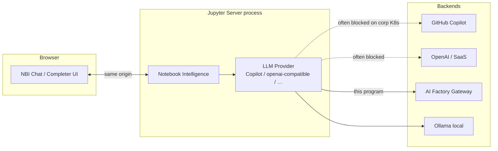

### 1.3 Built-in providers (relevant to AI Factory)

| Provider ID          | Auth                      | Custom `base_url` | Token refresh      |
| -------------------- | ------------------------- | ----------------- | ------------------ |
| `github-copilot`     | Device OAuth              | N/A               | Yes                |
| `openai-compatible`  | Static Bearer `api_key`   | Yes               | **No** (by itself) |
| `litellm-compatible` | Optional key + `base_url` | Yes               | No                 |
| `ollama`             | Local daemon              | Local             | N/A                |

**AI Factory** exposes an **OpenAI-compatible** Chat Completions API. Therefore NBI uses the stock **`openai-compatible`** provider. The hard parts on a corporate JupyterHub are **OIDC token lifecycle**, **TLS / corporate CA**, **egress / proxy**, and **per-user quota** — not the message schema.

### 1.4 Why not GitHub Copilot on the internal cluster?

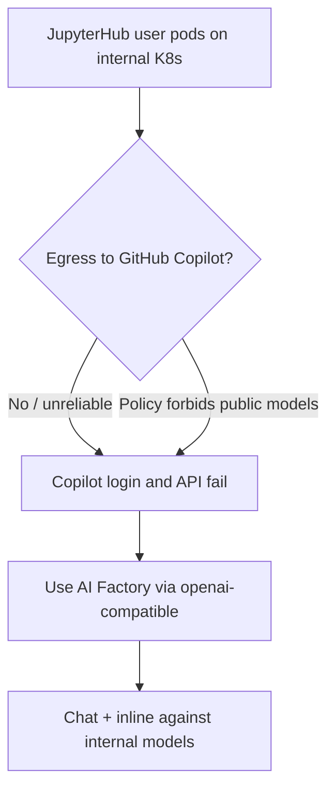

Org goals typically include:

- Keep notebook/code traffic on **internal models**
- Bind usage to **Hub login identity**
- Enforce **quotas** and observability outside the browser

---

## 2. Quick demo: integrate NBI with AI Factory

**Audience:** Platform engineers who already have JupyterHub + NBI installed and need a **same-day demo**.  
**Not for production** (tokens expire; no per-pod auth isolation).

### 2.1 Path selection

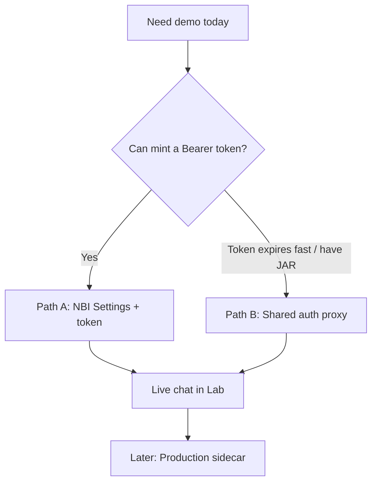

| Path                        | Time      | Summary                                          | Risk                    |
| --------------------------- | --------- | ------------------------------------------------ | ----------------------- |
| **A. Settings + Bearer**    | 15–60 min | Point `openai-compatible` at AI Factory          | Token TTL; demo only    |
| **B. Shared cluster proxy** | 2–4 h     | One Deployment mints/refreshes; NBI hits Service | Shared credentials      |
| **C. Per-pod sidecar**      | 1–2 days  | Production shape                                 | Too slow for “demo now” |

### 2.2 Path A — configuration

In JupyterLab → **NBI Settings** → **OpenAI Compatible**:

| Field    | Example value                             |
| -------- | ----------------------------------------- |
| Provider | `openai-compatible`                       |
| Base URL | `https://gateway.example.com/v1`          |
| API key  | Current OIDC / gateway Bearer             |
| Model    | `databricks/gdp-gpt4o` (or corp model id) |

**Rules:**

- Base URL must end at `/v1` — **not** `/v1/chat/completions`.
- `GET /v1/models` may return **404** on AI Factory; that is OK. NBI uses **`POST /v1/chat/completions`**.

Optional — hide Copilot:

```python
c.NotebookIntelligence.disabled_providers = ["github-copilot"]
```

### 2.3 Path A — prove connectivity from the user pod

```bash
# Chat Completions (what NBI uses)
curl -sS -w "\nHTTP %{http_code}\n" \
  "https://<ai-factory-host>/v1/chat/completions" \
  -H "Authorization: Bearer <TOKEN>" \
  -H "Content-Type: application/json" \
  -d '{
    "model": "databricks/gdp-gpt4o",
    "messages": [{"role": "user", "content": "ping"}],
    "max_tokens": 32
  }'
```

Expect **HTTP 200** and an assistant reply.

```bash
python - <<'PY'
from openai import OpenAI
client = OpenAI(base_url="https://<ai-factory-host>/v1", api_key="<TOKEN>")
r = client.chat.completions.create(
    model="databricks/gdp-gpt4o",
    messages=[{"role": "user", "content": "ping"}],
    max_tokens=32,
)
print(r.choices[0].message.content)
PY
```

### 2.4 Path A — demo checklist

- [ ] `curl` `POST /v1/chat/completions` → 200 from the **user pod**
- [ ] AI Factory host is on `NO_PROXY` / `no_proxy` if the pod uses `HTTPS_PROXY` (see §5)
- [ ] After env changes: **Stop → Start** user server (shell `export` does not update NBI)
- [ ] NBI Settings filled; chat works **without** GitHub login

### 2.5 Path B — shared auth proxy (optional)

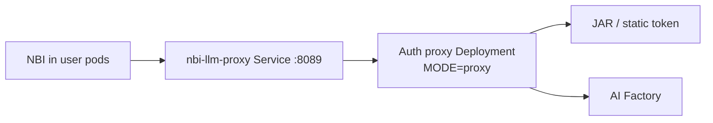

- Reuse in-repo sidecar: `local-dev/llm-gateway-sidecar`
- NBI `base_url` = `http://nbi-llm-proxy.<ns>.svc.cluster.local:8089/v1`
- Demo only: may bind `0.0.0.0` with `SIDECAR_ALLOW_NON_LOOPBACK=1`
- **Do not** use as multi-tenant production

### 2.6 Quick-demo data flow

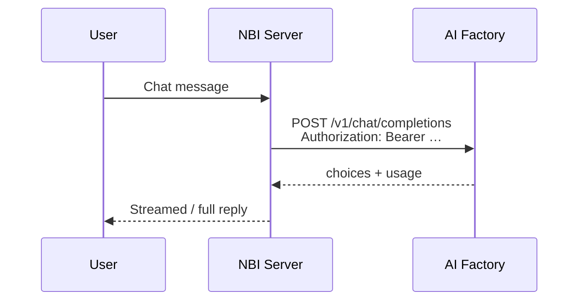

---

## 3. Production: integrate NBI with AI Factory

**Audience:** Platform teams hardening JupyterHub for many users.  
**Design decision (ADR):** **Auth sidecar in each user pod** + stock `openai-compatible`. Do **not** embed JAR minting inside the NBI process unless sidecars are forbidden.

### 3.1 Target architecture

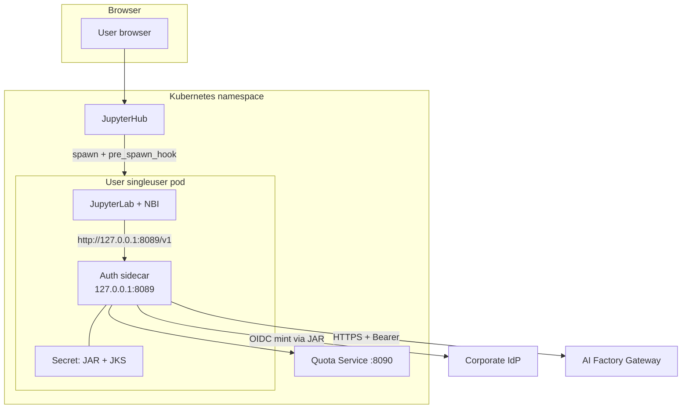

### 3.2 Production request sequence

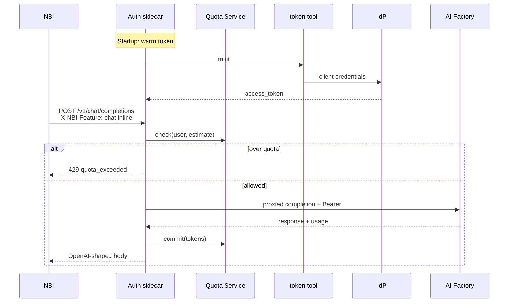

### 3.3 Delivery phases

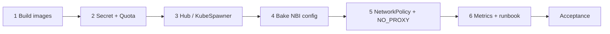

| Phase                   | Deliverable                                                       |
| ----------------------- | ----------------------------------------------------------------- |
| **1. Images**           | `nbi-singleuser` (JL + NBI + sidecar + entrypoint), `nbi-quota`   |
| **2. Cluster services** | Secret `nbi-llm-auth`, Deployment `nbi-quota`                     |
| **3. Hub config**       | `pre_spawn_hook`, image, env, volume mounts                       |
| **4. NBI defaults**     | Baked `config.json` → `http://127.0.0.1:8089/v1`; disable Copilot |
| **5. Network**          | `NO_PROXY` for AI Factory; NetworkPolicy deny direct gateway      |
| **6. Ops**              | `/metrics`, Grafana, alerts, runbook                              |

### 3.4 Build commands

```bash
cd /path/to/notebook-intelligence
TAG=dev ./local-dev/deploy/build-images.sh
docker tag nbi-singleuser:dev  ${REGISTRY}/nbi-singleuser:${TAG}
docker tag nbi-quota:dev       ${REGISTRY}/nbi-quota:${TAG}
docker push ${REGISTRY}/nbi-singleuser:${TAG}
docker push ${REGISTRY}/nbi-quota:${TAG}
```

Entrypoint contract: start sidecar → wait `/healthz` → `jupyterhub-singleuser`.

### 3.5 Secret (never commit binaries)

```bash
kubectl -n jhub create secret generic nbi-llm-auth \
  --from-file=token-tool.jar=./token-tool.jar \
  --from-file=keystore.jks=./keystore.jks \
  --from-file=truststore.jks=./aitruststore.jks \
  --from-literal=KEYSTORE_PASSWORD='***' \
  --from-literal=TRUSTSTORE_PASSWORD='***' \
  --from-literal=OIDC_TOKEN_URL='https://idp…/token' \
  --from-literal=OIDC_CLIENT_CODE='…' \
  --from-literal=OIDC_DOMAIN='…'
```

### 3.6 Hub configuration (excerpt)

```python
c.KubeSpawner.pre_spawn_hook = make_pre_spawn_hook(
    quota_service_url="http://nbi-quota.jhub.svc.cluster.local:8090",
)
c.KubeSpawner.cmd = ["/opt/nbi-local-dev/deploy/entrypoint.sh"]
c.KubeSpawner.environment.update({
    "MODE": "proxy",
    "TOKEN_PROVIDER": "jar",
    "TOKEN_JAR": "/var/run/nbi-llm-auth/token-tool.jar",
    "KEYSTORE_PATH": "/var/run/nbi-llm-auth/keystore.jks",
    "TRUSTSTORE_PATH": "/var/run/nbi-llm-auth/truststore.jks",
    "UPSTREAM_BASE_URL": "https://<ai-factory-host>/v1",
    "QUOTA_BACKEND": "http",
    "QUOTA_SERVICE_URL": "http://nbi-quota.jhub.svc.cluster.local:8090",
    "NBI_LLM_SIDECAR_URL": "http://127.0.0.1:8089",
    "HOST": "127.0.0.1",
    "PORT": "8089",
    "NBI_CHAT_MODEL_PROVIDER": "openai-compatible",
    "NBI_CHAT_MODEL_ID": "openai-compatible-chat-model",
    # Merge with existing corp NO_PROXY — required if HTTPS_PROXY/Zscaler is set
    "NO_PROXY": "<existing>,<ai-factory-host>,.<parent-domain>",
    "no_proxy": "<existing>,<ai-factory-host>,.<parent-domain>",
})
```

`pre_spawn_hook` injects `NBI_LLM_USER` / `NBI_LLM_GROUPS` / `NBI_LLM_PLAN` (plan is a **hint**; Quota Service is authoritative).

### 3.7 Baked NBI config (zero Settings)

```json
{
  "chat_model": {
    "provider": "openai-compatible",
    "model": "openai-compatible-chat-model",
    "properties": [
      { "id": "api_key", "value": "local" },
      { "id": "model_id", "value": "databricks/gdp-gpt4o" },
      { "id": "base_url", "value": "http://127.0.0.1:8089/v1" }
    ]
  }
}
```

### 3.8 Production acceptance

| Check                                | Expect                        |
| ------------------------------------ | ----------------------------- |
| `curl http://127.0.0.1:8089/healthz` | `token_warm: true`            |
| NBI chat                             | Reply; no GitHub login        |
| `/quota`                             | `user_id` = Hub username      |
| Two plans                            | Different limits by group     |
| Over quota                           | 429; Lab still usable         |
| Fresh PVC user                       | No Settings edits             |
| Direct gateway from notebook         | Blocked when NetworkPolicy on |

### 3.9 Known production limitations

| Topic                 | Note                                                                             |
| --------------------- | -------------------------------------------------------------------------------- |
| **Proxy SSE**         | Current sidecar may buffer full responses in `MODE=proxy`; validate streaming UX |
| **Agent / tools**     | Keep off until AI Factory tool-calling is confirmed                              |
| **Custom NBI plugin** | Deferred; ADR prefers sidecar                                                    |

---

## 4. Architecture comparison (demo vs production)

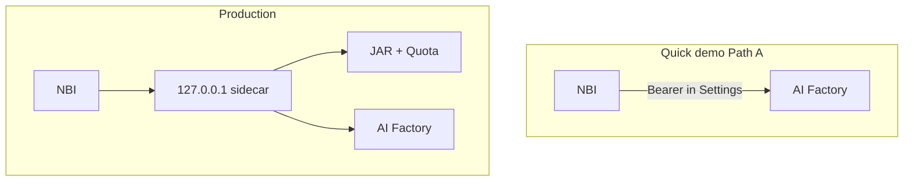

| Concern         | Quick demo             | Production                       |
| --------------- | ---------------------- | -------------------------------- |
| Auth            | Pasted / static Bearer | JAR mint + refresh in sidecar    |
| Secret location | User `config.json`     | K8s Secret, not in home PVC      |
| Quota           | Optional / none        | Quota Service + 429              |
| Isolation       | Weak                   | Loopback sidecar + NetworkPolicy |
| User setup      | Manual Settings        | Baked config + env locks         |
| Time to value   | Minutes–hours          | Days (image + Hub + secrets)     |

**Recommended narrative for stakeholders:** Demo with Path A to prove AI Factory + NBI wire-format; then land production sidecar before broad rollout.

---

## 5. Corporate network notes (proxy / Zscaler)

### 5.1 Typical failure

NBI log:

```text
openai._base_client — Retrying request to /chat/completions …
notebook_intelligence.api — Error in tool call loop: Connection error.
```

Often **not** a bad model name — the user pod cannot complete TCP/TLS to AI Factory (or Zscaler returns **502** on `CONNECT`).

### 5.2 Fix pattern

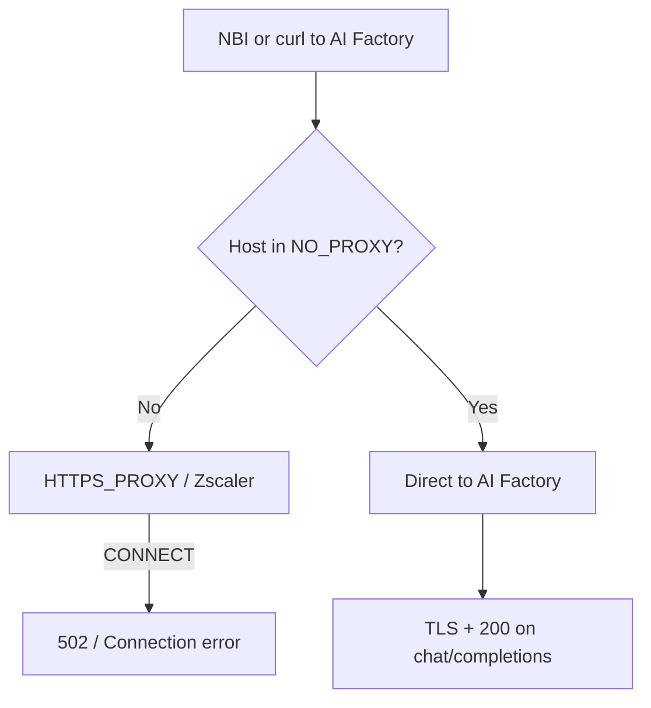

1. Append AI Factory FQDN (and parent domain) to **`NO_PROXY` and `no_proxy`**.
2. Persist via Hub / Helm `singleuser.extraEnv`.
3. **Restart** the user server.
4. Re-test `curl` and NBI chat.

Shell `export` in a Jupyter terminal **does not** update the already-running Jupyter Server / NBI process.

---

## 6. Quota, identity, and monitoring

### 6.1 Identity binding

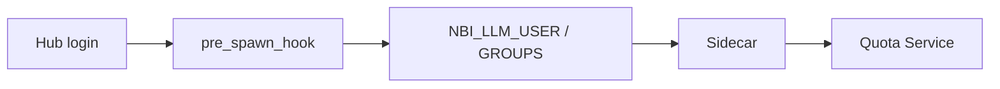

Use the **same** Hub username — no second LLM portal login.

### 6.2 Sidecar operator endpoints

| Endpoint                    | Purpose                 |
| --------------------------- | ----------------------- |
| `GET /healthz`              | Health + token warm     |
| `GET /quota`                | Remaining budget / plan |
| `GET /metrics`              | Prometheus counters     |
| `POST /v1/chat/completions` | Proxied LLM calls       |

NBI sidebar can show remaining quota via:

`GET /notebook-intelligence/llm-quota` → sidecar `/quota`.

### 6.3 Soft vs hard caps

- Soft (≥80%): allow request; metric / UI warning
- Hard (100%): HTTP **429**; chat shows plan + reset time; inline fails quietly

---

## 7. Troubleshooting

| Symptom                                       | Likely cause                | Action                                        |
| --------------------------------------------- | --------------------------- | --------------------------------------------- |
| `Connection error` + retries                  | Proxy / DNS / NetworkPolicy | Fix `NO_PROXY`; curl from pod; restart server |
| Zscaler **502** on CONNECT                    | Gateway not on `NO_PROXY`   | Add host; persist env; restart                |
| `GET /v1/models` → **404**                    | API not implemented         | Ignore; test `chat/completions`               |
| `chat/completions` **200** in curl, NBI fails | Server env stale            | Persist `NO_PROXY`; Stop/Start server         |
| **401/403**                                   | Token / ACL                 | Re-mint; check JAR / client                   |
| **429**                                       | Quota                       | Boost via Quota API or wait for reset         |
| `/healthz` 503 `token_warm:false`             | JAR / IdP / keystore        | Check Secret mounts and IdP egress            |

Break-glass and boost procedures: see in-repo `local-dev/docs/runbook.md`.

---

## 8. Security and compliance

- Do **not** store OIDC access tokens long-term in `~/.jupyter/nbi/config.json` for production.
- Keep JAR/JKS outside the writable home; mount read-only Secret (`0400`).
- Bind sidecar to **`127.0.0.1`** only.
- Prefer corporate CA PEM (`SSL_CERT_FILE` / `REQUESTS_CA_BUNDLE`) over `verify=False`.
- Redact `Authorization` in logs; do not warehouse raw prompts by default.
- Disable `github-copilot` in managed images when policy requires internal-only models.
- Notebook cells **will** be sent to AI Factory when users chat/complete — same classification as other internal LLM tools.

---

## 9. Roadmap and ownership

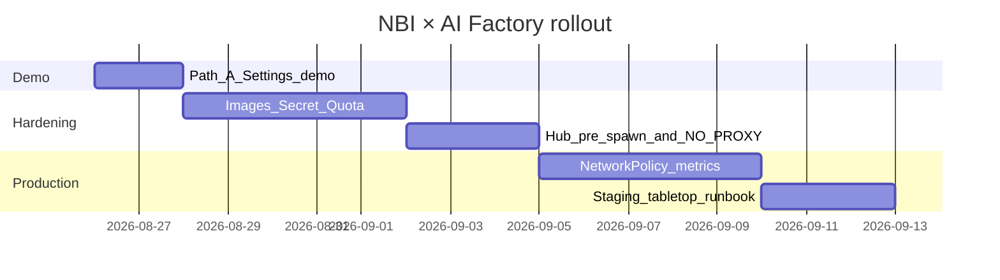

| Owner                   | Responsibilities                              |
| ----------------------- | --------------------------------------------- |
| **Platform / K8s**      | Images, Hub config, NetworkPolicy, `NO_PROXY` |
| **Identity / Security** | JAR, JKS, password rotation, CA               |
| **AI Factory / Model**  | Gateway URL, streaming/tools matrix, SLOs     |
| **Quota / FinOps**      | Plans, reports, boost policy                  |
| **NBI integrators**     | Baked config, provider lock, error UX         |

---

## 10. References

| Document                    | Location in repo                           |
| --------------------------- | ------------------------------------------ |
| Quick demo guide            | `docs/ai-factory-quick-demo.md`            |
| Full K8s deployment         | `docs/ai-factory-k8s-deployment.md`        |
| Requirements / architecture | `docs/internal-llm-gateway-integration.md` |
| User stories                | `docs/internal-llm-gateway-stories.md`     |
| Handoff                     | `docs/handoff-internal-llm-gateway.md`     |
| Go-live checklist           | `local-dev/docs/go-live-checklist.md`      |
| Operator runbook            | `local-dev/docs/runbook.md`                |
| Local spike README          | `local-dev/README.md`                      |
| ADR: sidecar vs plugin      | `local-dev/docs/adr-sidecar-vs-plugin.md`  |
| NBI admin guide             | `docs/admin-guide.md`                      |

---

## Appendix A — One-page cheat sheet

**Demo (Path A)**

```text
1. Mint Bearer for AI Factory
2. Ensure AI Factory host is on NO_PROXY (if HTTPS_PROXY set) → restart server
3. curl POST …/v1/chat/completions → HTTP 200
4. NBI Settings: base_url=…/v1 , api_key=Bearer , model=<id>
5. Chat “ping” in NBI
```

**Production**

```text
1. Build/push nbi-singleuser + nbi-quota
2. Create nbi-llm-auth Secret; deploy Quota Service
3. Hub: entrypoint + pre_spawn_hook + MODE=proxy + TOKEN_PROVIDER=jar
4. Bake NBI config → http://127.0.0.1:8089/v1 ; disable Copilot
5. NO_PROXY + NetworkPolicy; verify /healthz + chat + quota
```

---

## Appendix B — Glossary

| Term               | Meaning                                                      |
| ------------------ | ------------------------------------------------------------ |
| **NBI**            | Notebook Intelligence                                        |
| **AI Factory**     | Corporate OpenAI-compatible LLM Gateway                      |
| **Auth sidecar**   | Localhost process that mints OIDC tokens and proxies `/v1/*` |
| **Quota Service**  | Central plan catalog + usage counters                        |
| **Path A / B / C** | Demo Settings, shared proxy, or per-pod sidecar              |

---

**Page footer:** For questions, contact the Platform / ML Platform team. Keep secrets out of Confluence attachments; link to Secret Manager / vault runbooks instead.
