# Integrating an Internal LLM Gateway with Notebook Intelligence

This document describes **requirements** and a **concrete solution** for wiring a corporate OpenAI-compatible LLM Gateway into Notebook Intelligence (NBI), so JupyterLab users on an internal JupyterHub / Kubernetes cluster can use chat, inline edit, and autocomplete **without GitHub Copilot** (which is unreachable from the cluster network).

It is based on:

- An existing internal chatbot that mints an OIDC bearer token via a Java JAR (keystore / truststore), then calls `POST …/v1/chat/completions` with `Authorization: Bearer …`
- NBI’s built-in `openai-compatible` provider and JupyterHub deployment patterns in [`admin-guide.md`](admin-guide.md)

**Audience:** platform / ML platform engineers deploying NBI on JupyterHub, and developers extending NBI providers.

---

## Contents

1. [Problem statement](#1-problem-statement)
2. [Current internal chatbot pattern](#2-current-internal-chatbot-pattern)
3. [How NBI talks to LLMs today](#3-how-nbi-talks-to-llms-today)
4. [Requirements](#4-requirements)
5. [Gap analysis](#5-gap-analysis)
6. [Solution options](#6-solution-options)
7. [Recommended architecture (Auth Sidecar)](#7-recommended-architecture-auth-sidecar)
8. [Alternative: custom NBI provider plugin](#8-alternative-custom-nbi-provider-plugin)
9. [JupyterHub / Kubernetes deployment](#9-jupyterhub--kubernetes-deployment)
10. [NBI configuration (runtime schema)](#10-nbi-configuration-runtime-schema)
11. [Feature mapping (chatbot → JupyterLab)](#11-feature-mapping-chatbot--jupyterlab)
12. [Per-user identity, quota, and usage monitoring](#12-per-user-identity-quota-and-usage-monitoring)
13. [Security & compliance](#13-security--compliance)
14. [Phased delivery plan](#14-phased-delivery-plan)
15. [Acceptance criteria & test plan](#15-acceptance-criteria--test-plan)
16. [Risks and open questions](#16-risks-and-open-questions)

---

## 1. Problem statement

| Constraint                                                                                 | Impact on NBI                                                                                                                 |
| ------------------------------------------------------------------------------------------ | ----------------------------------------------------------------------------------------------------------------------------- |
| JupyterHub user pods run on an **internal Kubernetes** cluster                             | No reliable egress to GitHub Copilot device-login / Copilot API                                                               |
| Org policy prefers **internal models** for code assistance                                 | Must not send notebook/code to public Copilot by default                                                                      |
| Existing working path is an **internal LLM Gateway** (OpenAI Chat Completions wire format) | Auth is **OIDC client-credentials** via a **Java JAR** + JKS keystore/truststore, not a long-lived API key pasted in Settings |
| Gateway TLS may use corp PKI / non-public CAs (sample code used `verify=False`)            | Stock NBI OpenAI client has **no** `verify=False` knob; proper CA injection is preferred                                      |

**Goals:**

1. Users open JupyterLab → NBI chat / inline completion / agent tools work against the internal gateway model (e.g. `databricks/gdp-gpt4o`), with token minting and TLS handled transparently.
2. After JupyterHub login, each user is **automatically bound** to an LLM quota derived from their Hub identity (user / groups / org unit), and platform operators can **monitor and enforce** usage.

---

## 2. Current internal chatbot pattern

The reference script does four things:

1. **Mint token** — `java -jar token-tool-….jar` with `-Djavax.net.ssl.keyStore=…` / `trustStore=…`, talking to the corporate IdP token endpoint; parse JSON `access_token`.
2. **Create HTTP session** — `Authorization: Bearer <token>`, `Content-Type: application/json`.
3. **Call chat completions** — `POST https://gateway…/v1/chat/completions` with body `{ model, messages, temperature, max_tokens }`.
4. **Maintain multi-turn history** — append user/assistant messages locally.

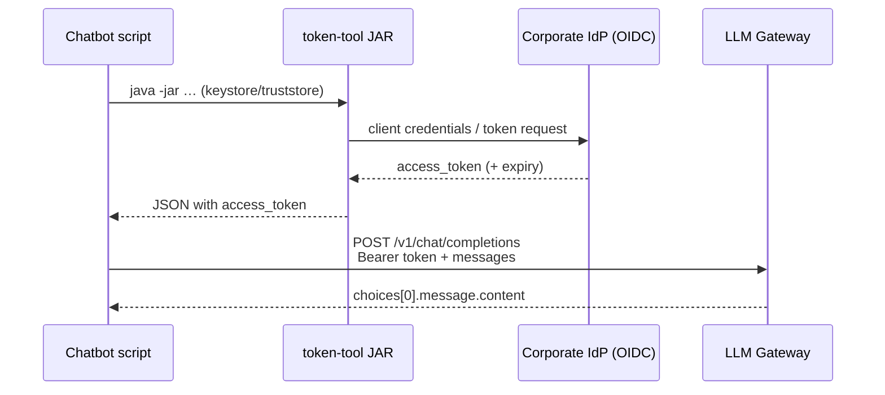

**Wire-format note:** The gateway is OpenAI-compatible. NBI’s `openai-compatible` provider already speaks this protocol via the official `openai` Python SDK (`chat.completions.create`). The hard part is **auth lifecycle + TLS**, not the message schema.

---

## 3. How NBI talks to LLMs today

NBI is a **per-user Jupyter Server extension**. The browser never calls the LLM directly; the server process does.

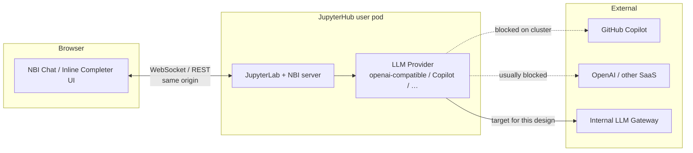

Built-in providers (see `notebook_intelligence/llm_providers/`):

| Provider ID          | Auth model                                 | Custom `base_url` | Token refresh           |
| -------------------- | ------------------------------------------ | ----------------- | ----------------------- |
| `github-copilot`     | Device OAuth + short-lived Copilot token   | N/A               | Yes (background thread) |
| `openai-compatible`  | Static `api_key` → `Authorization: Bearer` | Yes               | **No**                  |
| `litellm-compatible` | Optional static key + `base_url`           | Yes               | **No**                  |
| `ollama`             | Local daemon                               | Local             | N/A                     |

**Implication:** Pointing `openai-compatible` at `https://gateway…/v1` with `model_id=databricks/gdp-gpt4o` works **only if** something keeps a valid bearer in `api_key` (or fronts the gateway with a local proxy that injects the token).

---

## 4. Requirements

### 4.1 Functional

| ID  | Requirement                                                                                                                                             |
| --- | ------------------------------------------------------------------------------------------------------------------------------------------------------- |
| F1  | User can select the internal model in NBI Settings (or have it **preselected and locked** by admin).                                                    |
| F2  | **Chat panel** streams answers from the gateway (OpenAI chat completions).                                                                              |
| F3  | **Inline completion** (and inline chat where applicable) uses the same gateway/model (or a designated smaller model).                                   |
| F4  | Multi-turn chat history is maintained by NBI (same role/content message list as the sample chatbot).                                                    |
| F5  | Agent / tool-calling paths work **if** the gateway model supports OpenAI `tools` (otherwise degrade gracefully: chat-only).                             |
| F6  | No GitHub Copilot login required for the default path.                                                                                                  |
| F7  | OIDC access tokens are minted and refreshed **before expiry** without user intervention.                                                                |
| F8  | Works inside JupyterHub user pods on the internal cluster (egress only to IdP + gateway as allowed).                                                    |
| F9  | On Hub login / spawn, the user’s **stable identity** (Hub username, and optionally groups) is available to the LLM path without a second login.         |
| F10 | Each identity is assigned a **quota plan** (e.g. tokens/day, requests/day, model allow-list) automatically from login attributes or a directory lookup. |
| F11 | Every LLM call is **metered** (prompt/completion tokens, model, feature: chat vs inline) and attributed to that identity.                               |
| F12 | When quota is exceeded, further LLM calls are **denied** with a clear user-visible error; JupyterLab itself remains usable.                             |
| F13 | Operators can view per-user / per-team usage dashboards and export reports (day/week/month).                                                            |

### 4.2 Non-functional

| ID  | Requirement                                                                                                                                |
| --- | ------------------------------------------------------------------------------------------------------------------------------------------ |
| N1  | Secrets (keystore passwords, client material, tokens) must not appear in browser JS or git.                                                |
| N2  | Prefer corporate CA trust over `verify=False`; if verify must be disabled, confine it to a small trusted sidecar.                          |
| N3  | Multi-tenant Hub: one user’s credentials must not leak into another user’s home/PVC.                                                       |
| N4  | Image/bakeable config for common defaults; optional per-team model override.                                                               |
| N5  | Observability: log auth failures and gateway 4xx/5xx without logging full notebook contents or tokens.                                     |
| N6  | Cold start: first chat within ~few seconds after token mint (document JAR latency).                                                        |
| N7  | Quota enforcement is **authoritative outside the browser** (sidecar and/or central gateway). Client-side-only counters are not sufficient. |
| N8  | Metering pipeline must tolerate sidecar restarts (durable store or central gateway counters).                                              |
| N9  | PII in prompts/completions is **not** written to usage warehouses by default — store aggregates and metadata only.                         |

### 4.3 Out of scope (initial phase)

- Replacing Claude Code / Codex CLI integrations
- Fine-tuning or hosting the foundation model itself
- Browser-direct calls to the gateway (breaks Hub `base_url` and exposes tokens)

---

## 5. Gap analysis

| Capability needed                          | Built-in `openai-compatible`                     | Gap                                                                                                         |
| ------------------------------------------ | ------------------------------------------------ | ----------------------------------------------------------------------------------------------------------- |
| `base_url` + Bearer `api_key` + `model_id` | Supported                                        | —                                                                                                           |
| Model id like `databricks/gdp-gpt4o`       | Supported via `model_id`                         | —                                                                                                           |
| Path `/v1/chat/completions`                | SDK appends path when `base_url` ends with `/v1` | Use `…/v1`, not full completions URL                                                                        |
| Streaming for chat UI                      | Supported when `ChatResponse` is set             | Confirm gateway stream support                                                                              |
| Java JAR OIDC mint + JKS                   | **Not supported**                                | Must externalize or plugin                                                                                  |
| Automatic token refresh                    | **Only Copilot** has this                        | Must add sidecar or plugin                                                                                  |
| `verify=False` / custom TLS                | **Not supported** on provider                    | Sidecar or `SSL_CERT_FILE` / custom client                                                                  |
| `${ENV}` in `config.json`                  | **Not supported**                                | Inject via image config + env/sidecar                                                                       |
| Per-user quota from Hub login              | **Not supported**                                | Hub spawn hooks + sidecar/gateway + Quota Service ([§12](#12-per-user-identity-quota-and-usage-monitoring)) |
| Durable usage monitoring / billing         | Telemetry is in-process only                     | Sidecar metrics + warehouse; NBI telemetry optional supplement                                              |

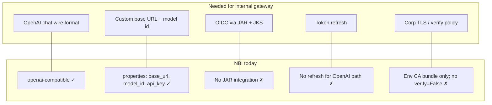

---

## 6. Solution options

| Option                                                  | Summary                                                                                                                                                     | Pros                                                  | Cons                                                 | When to choose                                |
| ------------------------------------------------------- | ----------------------------------------------------------------------------------------------------------------------------------------------------------- | ----------------------------------------------------- | ---------------------------------------------------- | --------------------------------------------- |
| **A. Auth sidecar / local reverse proxy** (recommended) | Small process in the user pod mints/refreshes OIDC, proxies `/v1/*` to the gateway; NBI uses stock `openai-compatible` against `http://127.0.0.1:<port>/v1` | No NBI fork; isolates Java/TLS; easy to swap gateways | Extra process + health checks                        | Hub / K8s production                          |
| **B. Custom NBI provider plugin**                       | `NotebookIntelligenceExtension` registers e.g. `corp-llm-gateway` that shells out to the JAR and calls OpenAI SDK with custom `httpx` client                | In-process; can expose Settings fields                | Couples NBI image to Java/JKS; more code to maintain | Need UI-native provider or no sidecar allowed |
| **C. Static bearer in Settings**                        | Paste current `access_token` into `api_key`                                                                                                                 | Zero engineering                                      | Tokens expire; ops nightmare                         | Spike / demo only                             |
| **D. Central org LiteLLM/proxy**                        | Cluster-wide proxy holds client creds; NBI points at it                                                                                                     | Single place for auth; multi-model routing            | Needs shared infra + tenancy design                  | Multiple products share one gateway           |

**Recommendation:** **Option A** for JupyterHub. Use **Option B** only if product ownership wants the provider visible as a first-class NBI provider without a sidecar. **Option C** is unacceptable for production.

---

## 7. Recommended architecture (Auth Sidecar)

### 7.1 High-level

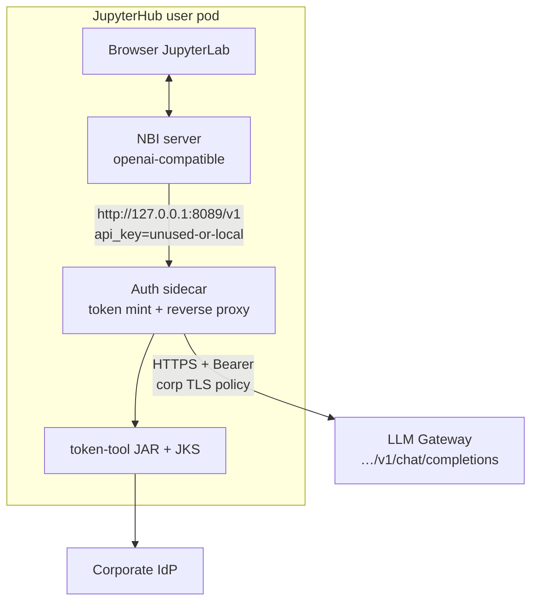

### 7.2 Sidecar responsibilities

1. On start (and on a timer before `expires_in`): run the same `java -jar …` flow as the sample `get_bearer_token()`.
2. Cache `access_token` in memory (never write to the user’s notebook tree).
3. Expose OpenAI-compatible routes, at minimum:
   - `POST /v1/chat/completions`
   - optionally `GET /v1/models` (static list if gateway has no models API)
4. Inject `Authorization: Bearer <cached>` toward the real gateway.
5. Apply TLS policy:
   - **Preferred:** mount corp CA / use truststore-derived PEM via `REQUESTS_CA_BUNDLE` / `SSL_CERT_FILE`
   - **Fallback:** `verify=False` **only inside the sidecar**, never in browser code
6. Bind to `127.0.0.1` only (not the pod network IP), so other pods cannot reuse the proxy.
7. **Identity & quota (see [§12](#12-per-user-identity-quota-and-usage-monitoring)):** read Hub-injected `NBI_LLM_USER` / plan metadata; check remaining quota before proxying; commit token usage from the gateway `usage` field; emit metrics; return `429` when exceeded.

### 7.3 NBI side (stock provider)

Configure chat + inline models to:

| Property         | Example value                                                   |
| ---------------- | --------------------------------------------------------------- |
| Provider         | `openai-compatible`                                             |
| `base_url`       | `http://127.0.0.1:8089/v1`                                      |
| `api_key`        | `local` (ignored by sidecar, or checked as a shared pod secret) |
| `model_id`       | `databricks/gdp-gpt4o`                                          |
| `context_window` | e.g. `128000` if known                                          |

Disable Copilot (and other SaaS providers) via Hub traitlets so users are not steered to a broken login:

```python
# jupyter_server_config.py (image or Hub-managed)
c.NotebookIntelligence.disabled_providers = [
    "github-copilot",
    "ollama",          # optional
    "litellm-compatible",  # optional
]
```

Lock defaults with env (see [`admin-guide.md`](admin-guide.md)):

```bash
NBI_CHAT_MODEL_PROVIDER=openai-compatible
NBI_CHAT_MODEL_ID=openai-compatible-chat-model
NBI_INLINE_COMPLETION_MODEL_PROVIDER=openai-compatible
NBI_INLINE_COMPLETION_MODEL_ID=openai-compatible-inline-completion-model
```

### 7.4 Sidecar ↔ gateway sequence

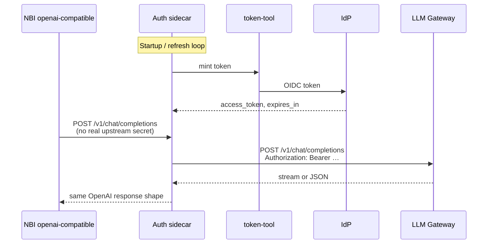

### 7.5 Minimal sidecar sketch (illustrative)

Not production code — shows the contract NBI expects:

```python
# Pseudo-code: local OpenAI-compatible reverse proxy
# - GET/POST /v1/*  →  gateway with refreshed Bearer
# - Listen 127.0.0.1:8089 only

UPSTREAM = "https://gateway.*.dev.azure.*.net/v1"
MODEL_DEFAULT = "databricks/gdp-gpt4o"

def ensure_token():
    # subprocess java -jar TOKEN_JAR … keystore/truststore …
    # cache until expires_in - skew
    ...

@app.post("/v1/chat/completions")
def chat_completions(request):
    token = ensure_token()
    return forward(
        method="POST",
        url=f"{UPSTREAM}/chat/completions",
        headers={"Authorization": f"Bearer {token}"},
        json=request.json(),
        verify=CORP_CA_BUNDLE or False,  # prefer CA bundle
        stream=True,
    )
```

Packaging options inside the user image:

- Supervisord / s6 / custom entrypoint starts `jupyterhub-singleuser` **and** the sidecar
- Or a Kubernetes **sidecar container** in the same pod sharing `localhost` via the pod network namespace (still bind proxy to localhost; IdP/gateway reachable from that container)

---

## 8. Alternative: custom NBI provider plugin

Use when a sidecar is not allowed and auth must live in the Jupyter process.

### 8.1 Extension loading

NBI loads plugins from:

```text
<sys.prefix>/share/jupyter/nbi_extensions/<name>/extension.json
```

```json
{
  "class": "corp_nbi_gateway.extension.CorpGatewayExtension"
}
```

`activate(host)` calls `host.register_llm_provider(CorpGatewayLLMProvider())`.

### 8.2 Provider design

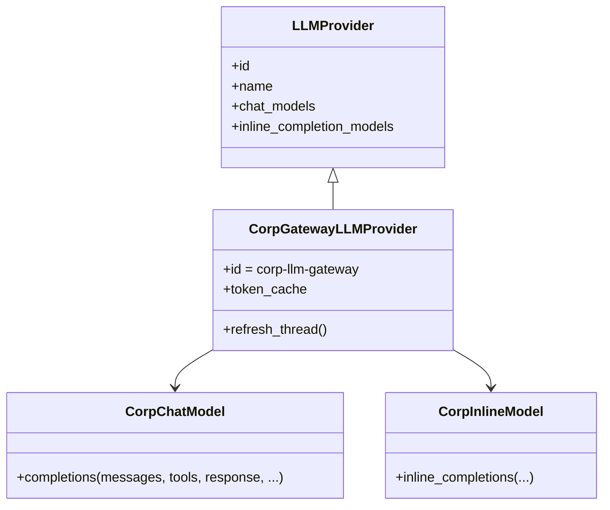

Implementation notes:

- Reuse patterns from `openai_compatible_llm_provider.py` (`OpenAI(base_url=…, api_key=…, http_client=httpx.Client(verify=…))`).
- Reuse Copilot’s **background refresh** idea (`github_copilot` token thread): refresh at `expires_in - skew`.
- Shell out to the JAR with timeouts; never block the event loop without a worker thread.
- Provider property fields (optional UI): `model_id`, `base_url`, `context_window` — **not** raw OIDC tokens.
- Keystore paths and passwords: **environment / mounted secrets only**.

### 8.3 Trade-offs vs sidecar

|                           | Sidecar (A)                                 | Plugin (B)                                 |
| ------------------------- | ------------------------------------------- | ------------------------------------------ |
| NBI upgrade cost          | Low (stock provider)                        | Must re-test plugin each NBI release       |
| Java/JKS in Jupyter image | Can stay in sidecar image layer             | Required in singleuser image               |
| Failure isolation         | Proxy crash ≠ Jupyter crash (if supervised) | Auth bugs take down completions inside NBI |
| Settings UX               | Looks like OpenAI-compatible                | Can brand “Corp LLM Gateway”               |

---

## 9. JupyterHub / Kubernetes deployment

### 9.1 Reference pod layout

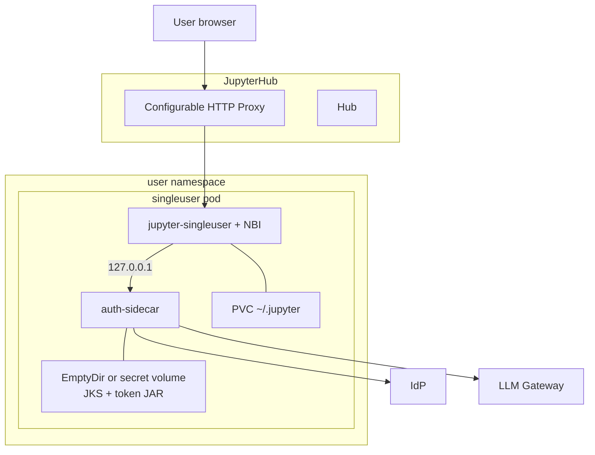

### 9.2 Image / secrets checklist

| Item                 | Recommendation                                                                                   |
| -------------------- | ------------------------------------------------------------------------------------------------ |
| NBI wheel            | Preinstall in singleuser image (pin version)                                                     |
| Base NBI config      | `<sys.prefix>/share/jupyter/nbi/config.json` with openai-compatible defaults pointing at sidecar |
| Token JAR + JKS      | Mount from Secret/CSI; file mode `0400`; not in git                                              |
| Keystore password    | Env from Secret (`KEYSTORE_PASSWORD`, etc.) — never in `config.json`                             |
| Java runtime         | JRE in sidecar image (or singleuser if plugin)                                                   |
| NetworkPolicy        | Egress allowlist: IdP host, gateway host, DNS, Hub; **deny** public GitHub Copilot if required   |
| `disabled_providers` | Hide `github-copilot` so UI does not offer a dead path                                           |

### 9.3 Why LLM calls stay server-side

Hub users hit `/user/<name>/…`. NBI already proxies LLM traffic through the Jupyter Server. The browser does **not** need the corp CA or the JAR. This matches [`admin-guide.md`](admin-guide.md) guidance on custom CAs.

---

## 10. NBI configuration (runtime schema)

Settings persistence uses **`chat_model` / `inline_completion_model`** objects with a `properties` array (what the Settings UI saves). Example for the sidecar approach:

```json
{
  "chat_model": {
    "provider": "openai-compatible",
    "model": "openai-compatible-chat-model",
    "properties": [
      {
        "id": "api_key",
        "name": "API key",
        "description": "API key",
        "value": "local",
        "optional": false
      },
      {
        "id": "model_id",
        "name": "Model",
        "description": "Model (must support streaming)",
        "value": "databricks/gdp-gpt4o",
        "optional": false
      },
      {
        "id": "base_url",
        "name": "Base URL",
        "description": "Base URL",
        "value": "http://127.0.0.1:8089/v1",
        "optional": true
      },
      {
        "id": "context_window",
        "name": "Context window",
        "description": "Context window length",
        "value": "128000",
        "optional": true
      }
    ]
  },
  "inline_completion_model": {
    "provider": "openai-compatible",
    "model": "openai-compatible-inline-completion-model",
    "properties": [
      {
        "id": "api_key",
        "value": "local",
        "optional": false
      },
      {
        "id": "model_id",
        "value": "databricks/gdp-gpt4o",
        "optional": false
      },
      {
        "id": "base_url",
        "value": "http://127.0.0.1:8089/v1",
        "optional": true
      },
      {
        "id": "context_window",
        "value": "128000",
        "optional": true
      }
    ]
  }
}
```

Bake this into the image at:

```text
$CONDA_PREFIX/share/jupyter/nbi/config.json
```

or copy into the user’s `~/.jupyter/nbi/config.json` on first spawn (Hub lifecycle hook).

> **Note:** Some examples in [`admin-guide.md`](admin-guide.md#self-hosted-llm-endpoints) show a top-level `"providers": { "openai-compatible": { … } }` shape and `${ENV}` placeholders. The **Settings / runtime path** uses the `chat_model.properties` schema above; `${ENV_VAR}` interpolation inside `config.json` is **not** currently supported. Prefer sidecar localhost + non-secret `api_key`, or a custom plugin that reads secrets from the environment.

---

## 11. Feature mapping (chatbot → JupyterLab)

| Sample chatbot                          | NBI surface             | Notes                                                                                |
| --------------------------------------- | ----------------------- | ------------------------------------------------------------------------------------ |
| `messages` system + user/assistant loop | Chat sidebar            | NBI owns history and participants (`@workspace`, tools, …)                           |
| `ask_llm(session, messages)`            | `ChatModel.completions` | Streaming preferred for UX                                                           |
| Single model string                     | `model_id` property     | Can later offer a small catalog via sidecar `/v1/models`                             |
| —                                       | Inline completer        | Extra traffic; tune debounce in Settings to control cost                             |
| —                                       | Agent / notebook tools  | Requires gateway **tool calling**; validate before enabling Agent mode for all users |
| Manual CLI                              | Zero-click after spawn  | Sidecar + locked provider                                                            |

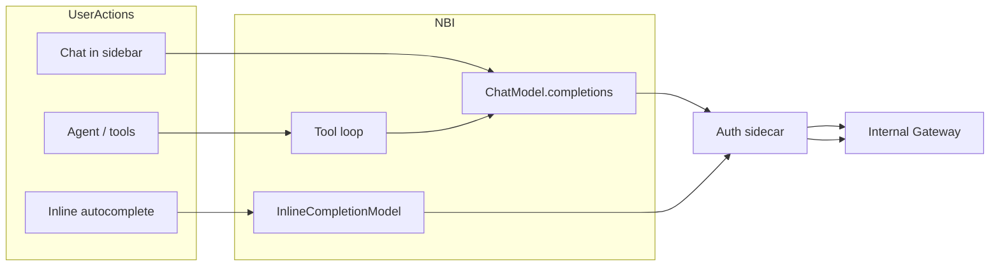

---

## 12. Per-user identity, quota, and usage monitoring

NBI today has **no built-in quota or billing engine**. Its telemetry hooks ([`admin-guide.md` — Telemetry events](admin-guide.md#telemetry-events)) are **in-process only** and are not a substitute for multi-tenant metering. Claude-mode “show usage after each turn” is a UX footer, not an enforcement plane.

Therefore, **identity → quota → meter → enforce → observe** must live in the **Hub spawn path + auth sidecar and/or central LLM Gateway**, with NBI remaining the IDE client.

### 12.1 Design principle

| Layer                                 | Responsibility                                                  | Why                                                                             |
| ------------------------------------- | --------------------------------------------------------------- | ------------------------------------------------------------------------------- |
| **JupyterHub Authenticator**          | Establishes who the user is (`username`, groups, org)           | Single login; already trusted                                                   |
| **KubeSpawner / lifecycle hooks**     | Injects identity + plan metadata into the user pod              | Automatic at every spawn / resume                                               |
| **Auth sidecar (or central gateway)** | Looks up / caches quota, meters tokens, allows or rejects calls | Authoritative; cannot be bypassed if NetworkPolicy blocks direct gateway egress |
| **Quota / usage store**               | Durable counters and plan definitions                           | Survives pod restarts                                                           |
| **Observability stack**               | Dashboards, alerts, reports                                     | Ops visibility                                                                  |
| **NBI**                               | Calls localhost OpenAI API; surfaces 429/403 errors in chat     | No second login; no local “fake” quota                                          |

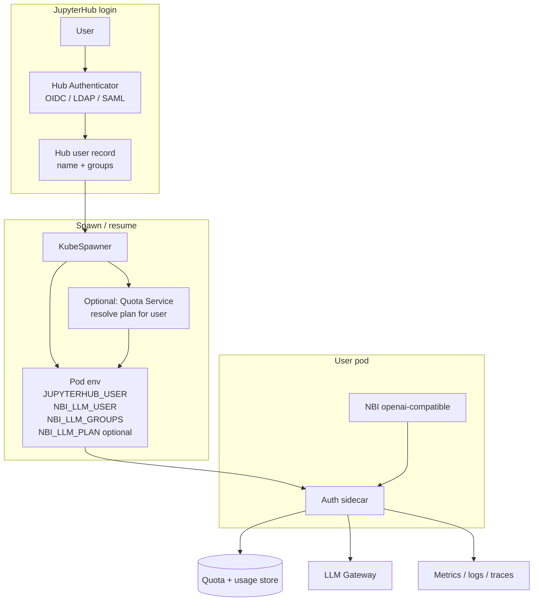

### 12.2 Identity from JupyterHub login

Use the **same identity** the user just authenticated with. Do not invent a parallel LLM login.

| Source                                       | Typical value                                 | Use                                        |
| -------------------------------------------- | --------------------------------------------- | ------------------------------------------ |
| `JUPYTERHUB_USER`                            | Hub username (e.g. `jdoe` or `jdoe@corp.com`) | Primary subject key for quota              |
| `JUPYTERHUB_API_TOKEN`                       | Per-server token                              | Optional: sidecar calls Hub API for groups |
| Authenticator `auth_state` / `manage_groups` | AD/OIDC groups                                | Map `team-ml`, `intern`, … → quota plans   |
| Custom claim (OIDC)                          | `employee_type`, `cost_center`                | Finer plan selection                       |

**Spawn-time injection (recommended):**

```python
# jupyterhub_config.py (illustrative)
async def pre_spawn_hook(spawner):
    auth_state = await spawner.user.get_auth_state() or {}
    groups = sorted(spawner.user.groups)  # if manage_groups=True
    # Resolve plan id from directory / Quota Service (see 12.3)
    plan = await quota_client.resolve_plan(
        username=spawner.user.name,
        groups=[g.name for g in groups],
        auth_state=auth_state,
    )
    spawner.environment.update({
        "NBI_LLM_USER": spawner.user.name,
        "NBI_LLM_GROUPS": ",".join(g.name for g in groups),
        "NBI_LLM_PLAN": plan["id"],           # e.g. standard | power | intern
        "NBI_LLM_QUOTA_TOKENS_DAY": str(plan["tokens_per_day"]),
        "NBI_LLM_QUOTA_REQ_DAY": str(plan["requests_per_day"]),
    })

c.KubeSpawner.pre_spawn_hook = pre_spawn_hook
```

The auth sidecar reads these env vars at start and attaches them to every upstream request (and to local metering).

> **Trust note:** Env vars inside the user pod are visible to the notebook user. Treat plan ids as **hints for UX**, but enforce using a **server-side store** keyed by `NBI_LLM_USER` that the user cannot raise arbitrarily. If the sidecar only trusts env without a central check, a user could edit a local config and claim a higher plan — so either (a) the sidecar re-validates plan via Quota Service with a pod service account, or (b) enforcement happens at a **central gateway** that ignores client-supplied plan headers unless signed.

### 12.3 Quota model

Define plans centrally (DB / ConfigMap / internal API), not in each user’s `config.json`.

| Dimension        | Examples                                                                                |
| ---------------- | --------------------------------------------------------------------------------------- |
| Subject          | `user:<name>`, `group:<team>`, default catch-all                                        |
| Window           | Calendar day (UTC or local), rolling 24h, calendar month                                |
| Budgets          | `tokens_in + tokens_out`, or weighted tokens; optional separate caps for chat vs inline |
| Rate             | Requests / minute (burst control)                                                       |
| Model allow-list | e.g. only `databricks/gdp-gpt4o`; deny larger models for `intern`                       |
| Soft vs hard     | Soft: warn at 80%; hard: HTTP 429 at 100%                                               |

Example plan table:

| Plan       | Who (login rule)    | Tokens / day | Req / day | Models             |
| ---------- | ------------------- | ------------ | --------- | ------------------ |
| `intern`   | group `interns`     | 200k         | 200       | gdp-gpt4o          |
| `standard` | default employees   | 2M           | 2_000     | gdp-gpt4o          |
| `power`    | group `ml-platform` | 20M          | 20_000    | gdp-gpt4o + larger |

Resolution order: explicit user override → highest matching group plan → `standard` default.

### 12.4 Where to enforce (recommended: sidecar + central store)

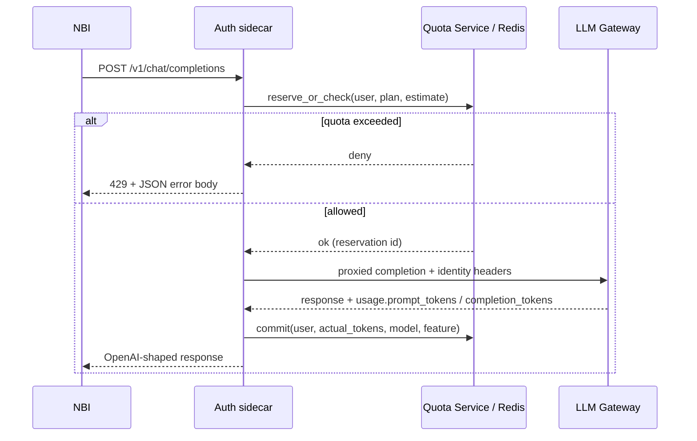

**Why not enforce only inside NBI?**

- NBI can be reconfigured by a power user (unless fully locked) or bypassed by other clients in the pod.
- With NetworkPolicy **denying** direct egress to the gateway except from the sidecar (or forcing all traffic through a central gateway), enforcement at the proxy is binding.

**Central gateway option:** If the org LLM Gateway already supports per-API-key or per-`X-User-Id` quotas, map Hub username → gateway consumer at spawn (mint a **user-scoped** credential or pass a signed identity header). Then the sidecar mainly does JAR auth for the _platform_ client, and the gateway meters per end-user. Prefer this when many products share one gateway.

### 12.5 Metering: what to record

Parse OpenAI-compatible `usage` from the gateway response (and accumulate for streams when the final chunk includes usage):

| Field                                                  | Source                                                                                    |
| ------------------------------------------------------ | ----------------------------------------------------------------------------------------- |
| `user_id`                                              | `NBI_LLM_USER` / Hub username                                                             |
| `groups`                                               | `NBI_LLM_GROUPS`                                                                          |
| `plan_id`                                              | Resolved plan                                                                             |
| `model`                                                | Request `model`                                                                           |
| `feature`                                              | `chat` \| `inline` \| `agent` (sidecar infers from header or path tag NBI can send later) |
| `prompt_tokens` / `completion_tokens` / `total_tokens` | Response `usage`                                                                          |
| `latency_ms` / `status`                                | Sidecar timing                                                                            |
| `pod_name` / `hub`                                     | Downward API (ops debug)                                                                  |
| `ts`                                                   | Event time                                                                                |

**Feature tagging (optional enhancement):** Have the sidecar accept e.g. `X-NBI-Feature: inline` from a thin NBI fork, or run two localhost ports (`8089` chat, `8090` inline) mapped in config so inline spend can be capped separately without changing NBI much.

Emit:

1. **Synchronous counter update** to Redis / DB (enforcement).
2. **Async event** to Kafka / OpenTelemetry / Prometheus (`nbi_llm_tokens_total{user,plan,model,feature}`).

Do **not** store raw prompts/completions in the usage warehouse by default (N9).

### 12.6 User-visible behavior when over quota

| Channel           | Behavior                                                                                                                                                                                                |
| ----------------- | ------------------------------------------------------------------------------------------------------------------------------------------------------------------------------------------------------- |
| Chat              | Sidecar returns `429` with body like `{"error":{"message":"LLM daily quota exceeded (plan=standard). Resets at 00:00 UTC.","type":"quota_exceeded"}}`. NBI surfaces the message in the chat error path. |
| Inline completion | Same 429; completer fails quietly or shows a short status — document expected UX.                                                                                                                       |
| Remaining budget  | Optional `GET http://127.0.0.1:8089/quota` for a small Lab indicator (custom extension); not required for MVP.                                                                                          |

### 12.7 Monitoring & reporting for operators

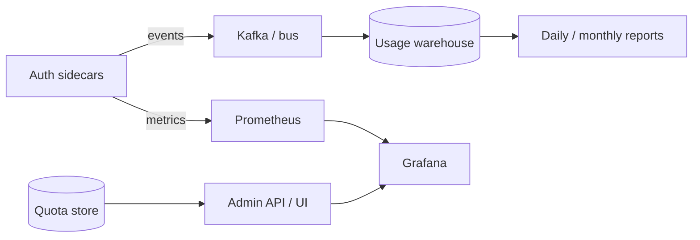

Minimum dashboards:

- Tokens and requests per user / team / plan (day)
- Top users and denial rate (`quota_exceeded`)
- Gateway latency and error ratio
- Model mix
- Alert: store unreachable, denial spike, single user > soft cap

Admin API examples (Quota Service):

- `GET /v1/usage?user=&from=&to=`
- `GET /v1/quota/{user}` → `{ plan, used_tokens, limit_tokens, reset_at }`
- `PUT /v1/quota/{user}` → temporary boost (break-glass)

### 12.8 Mapping login → plan (worked example)

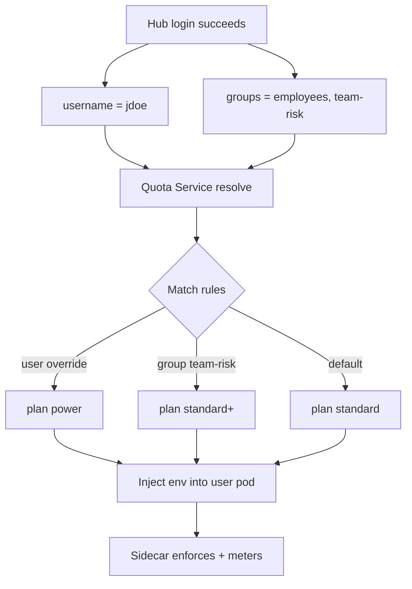

### 12.9 What NBI should and should not do

| Do                                                                         | Do not                                                         |
| -------------------------------------------------------------------------- | -------------------------------------------------------------- |
| Point at sidecar; show gateway/sidecar errors                              | Implement durable quotas only in the frontend                  |
| Optionally lock provider so users cannot aim at another URL                | Trust a user-editable “remaining tokens” field in Settings     |
| Use Hub username as the subject (via sidecar env)                          | Require a second LLM portal login for every user               |
| Rely on NBI telemetry only as a **supplementary** product-analytics signal | Treat in-process telemetry as the system of record for billing |

NBI’s existing telemetry (chat feedback, inline usage events) can be forwarded to the same observability stack for **product** metrics, but **quota truth** remains the sidecar/gateway meter that sees every completion.

### 12.10 Implementation checklist

- [ ] Hub Authenticator provides stable usernames; enable `manage_groups` if plans are group-based.
- [ ] `pre_spawn_hook` (or equivalent) sets `NBI_LLM_USER` / groups; resolves plan via Quota Service.
- [ ] Quota Service + durable store (Redis/Postgres) with plan catalog and per-subject counters.
- [ ] Auth sidecar: check → proxy → commit usage; expose Prometheus metrics.
- [ ] NetworkPolicy: user pods cannot reach LLM Gateway except via sidecar or approved egress.
- [ ] Grafana dashboards + over-quota alerts.
- [ ] Runbook: raise quota, reset window, break-glass for incidents.
- [ ] Document 429 copy for end users (internal portal / Hub announcement).

---

## 13. Security & compliance

1. **Do not** store OIDC access tokens in `~/.jupyter/nbi/config.json` (shared PVC risk, plaintext).
2. Keep JKS and JAR outside the user’s writable home when possible (read-only mount).
3. Restrict sidecar to `127.0.0.1`; NetworkPolicy for IdP/gateway only.
4. Prefer CA pinning over `verify=False`; if verify must be off, document residual MITM risk on the pod network.
5. Redact `Authorization` headers in logs; NBI already scrubs many secrets from tool output — keep that enabled.
6. Disable GitHub Copilot in managed images so users cannot accidentally attempt external auth.
7. Align with data-classification rules: notebook cells and outputs **will** be sent to the internal gateway when users chat/complete — same as the sample chatbot.
8. **Quota identity:** never trust unauthenticated client-supplied `X-User-Id` at a shared gateway; bind identity at spawn (pod env + service-account validation) or use gateway-issued per-user credentials.
9. **Usage data:** store aggregates (tokens, model, user id); avoid persisting prompt/response bodies in the metering pipeline.

---

## 14. Phased delivery plan

| Phase                   | Deliverable                                                                           | Exit criteria                                      |
| ----------------------- | ------------------------------------------------------------------------------------- | -------------------------------------------------- |
| **P0 – Spike**          | Sidecar MVP + NBI openai-compatible against localhost; one model                      | Chat round-trip in a Hub pod                       |
| **P1 – Hardening**      | Token refresh, health endpoint, CA bundle, supervisord, NetworkPolicy                 | 24h soak; no manual re-login                       |
| **P2 – UX / admin**     | Image-baked config, `disabled_providers`, locked model env vars                       | New users get working NBI with zero Settings edits |
| **P3 – Feature parity** | Validate streaming, inline completion, tool calling; document unsupported modes       | Published internal runbook                         |
| **P4 – Quota MVP**      | Hub `pre_spawn_hook` identity env + sidecar check/commit against Redis; 429 on exceed | Two users, different plans; over-quota denied      |
| **P5 – Monitor**        | Prometheus metrics + Grafana; daily usage report job                                  | Ops can answer “who used how much yesterday?”      |
| **P6 – Optional**       | Branded custom provider plugin, central gateway per-user keys, in-Lab quota indicator | Product decision                                   |

Estimated dependency ownership:

- **Platform:** JAR distribution, JKS rotation, NetworkPolicy, image entrypoint, Hub hooks
- **Quota platform:** plan catalog, Quota Service, stores, dashboards
- **NBI integrators:** config bake-in, provider lock, validation matrix, error UX
- **Model owners:** gateway SLOs, streaming/tools support matrix, optional native per-user quota APIs

---

## 15. Acceptance criteria & test plan

### Acceptance

- [ ] Fresh Hub user can open NBI chat and receive a streamed reply from `databricks/gdp-gpt4o` (or chosen model) with **no** GitHub login.
- [ ] Inline completion returns suggestions in a code cell.
- [ ] After token TTL, chat still works (refresh path verified by forcing short TTL in test).
- [ ] Killing public DNS / blocking `github.com` does **not** break the internal path.
- [ ] `jupyter labextension list` / server extension list show NBI OK.
- [ ] No bearer token or keystore password in browser network logs.
- [ ] After Hub login, sidecar meters usage under that user’s Hub username **without** a second LLM login.
- [ ] User on plan A and user on plan B receive different limits automatically (group or directory rule).
- [ ] Exhausting the daily token budget yields **429** / clear chat error; further calls stay denied until reset.
- [ ] Operators can see per-user token totals for the last 24h in Grafana or a report.

### Test matrix

| Case                               | Expect                                                |
| ---------------------------------- | ----------------------------------------------------- |
| Sidecar down                       | Clear error in chat; JupyterLab still usable          |
| IdP 401/5xx                        | Sidecar retries/backoff; NBI surfaces auth error      |
| Gateway 429                        | User-visible rate-limit message                       |
| Tools enabled, model without tools | Chat works; agent tools skipped or error documented   |
| Multi-user two pods                | Isolated tokens; no cross-read of secrets             |
| User edits local env/plan hint     | Central Quota Service still enforces real plan        |
| Pod restart mid-day                | Usage counters preserved (durable store)              |
| Soft-cap threshold                 | Warning metric/alert; hard-cap still enforced at 100% |
| Inline vs chat                     | Both counted; optional separate budgets if configured |

---

## 16. Risks and open questions

| Risk / question                                 | Mitigation / owner                                                                                          |
| ----------------------------------------------- | ----------------------------------------------------------------------------------------------------------- |
| Gateway lacks **streaming**                     | Confirm SSE/chunk support; otherwise NBI chat UX degrades (wait for full response)                          |
| Gateway lacks **tool calling**                  | Keep Agent mode off or limited; chat + inline only                                                          |
| JAR startup latency                             | Warm token at sidecar start; show “warming auth” only if first call is slow                                 |
| Keystore rotation                               | Sidecar reload or pod recycle policy                                                                        |
| `verify=False` in sample                        | Replace with corp CA PEM before production                                                                  |
| Admin-guide `providers` JSON vs Settings schema | Use Section 10 schema for automation                                                                        |
| Model renaming / multi-model catalog            | Sidecar `/v1/models` + multiple NBI configs or LiteLLM in front                                             |
| Streaming responses omit final `usage`          | Buffer and estimate from tokenizer, or disable stream for metering-critical paths; confirm gateway behavior |
| Username normalization (`jdoe` vs email)        | Canonicalize in Quota Service; one subject key forever                                                      |
| Shared accounts / admin impersonation           | Hub admin “play as user” must not inherit victim quota incorrectly — log actor separately                   |
| Users bypass sidecar                            | NetworkPolicy + deny direct gateway; periodic egress audits                                                 |

---

## Appendix A — Mapping from sample script symbols

| Sample script                       | Integration target                                            |
| ----------------------------------- | ------------------------------------------------------------- |
| `API_URL` `…/v1/chat/completions`   | Sidecar upstream; NBI `base_url` = `http://127.0.0.1:8089/v1` |
| `MODEL_NAME` `databricks/gdp-gpt4o` | NBI `model_id`                                                |
| `TOKEN_JAR` + JKS                   | Sidecar volume / env                                          |
| `get_bearer_token()`                | Sidecar refresh loop                                          |
| `create_session()`                  | Sidecar outbound headers                                      |
| `ask_llm(session, messages)`        | NBI `ChatModel.completions` / inline model                    |
| `run_chatbot()` message loop        | NBI chat UI (do not reimplement in frontend)                  |

## Appendix B — Related docs

- [`../local-dev/README.md`](../local-dev/README.md) — **local test stack** (JupyterLab 4.5.9 + NBI + mock sidecar)
- [`internal-llm-gateway-stories.md`](internal-llm-gateway-stories.md) — user stories, sub-tasks, and requirement traceability (E0–E6 / LLM-S01–S24)
- [`admin-guide.md`](admin-guide.md) — Hub config, `disabled_providers`, CA/proxy env vars
- [`troubleshooting.md`](troubleshooting.md) — provider 401 / empty models
- [`building-and-packaging.md`](building-and-packaging.md) — building NBI wheels for the singleuser image
- [`jupyterlab-compatibility.md`](jupyterlab-compatibility.md) — JupyterLab 4.x pins for the image

## Appendix C — Decision summary

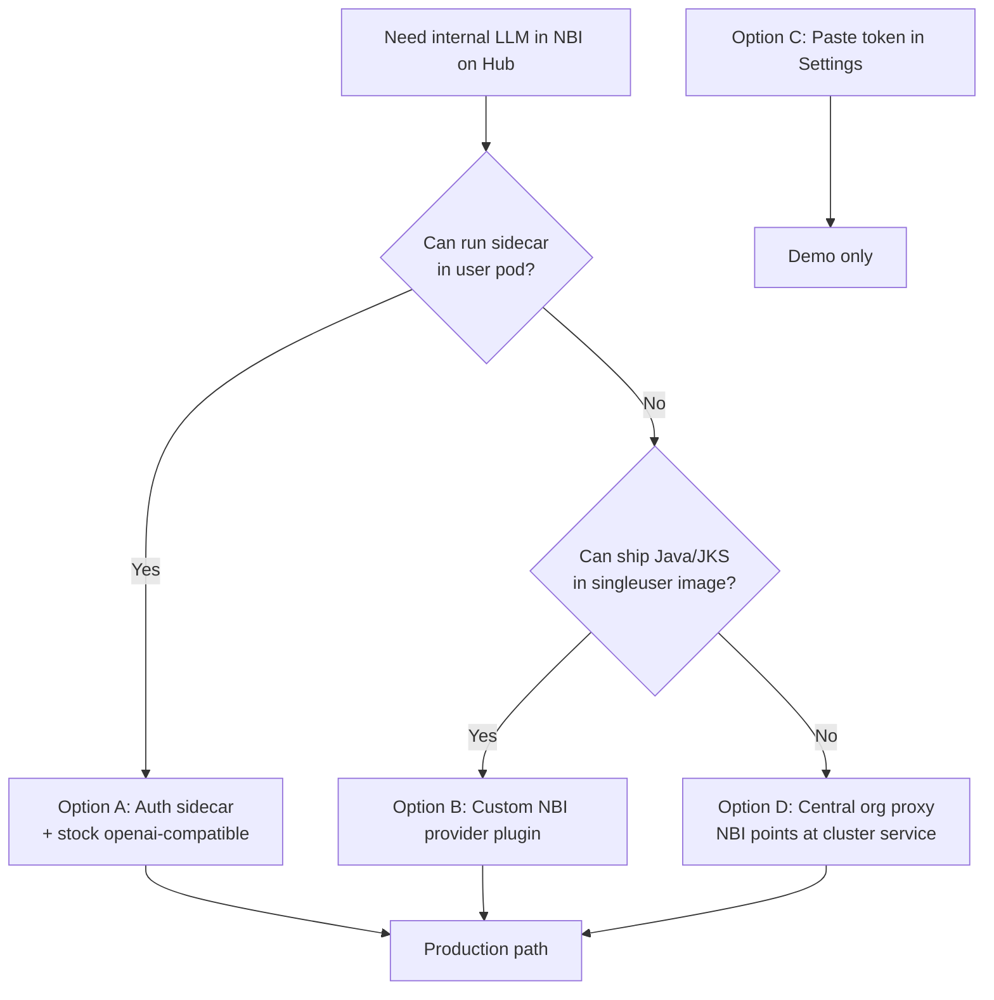

**Bottom line:** Treat the internal gateway as an OpenAI-compatible backend. Do **not** rely on GitHub Copilot. Put **OIDC JAR auth + TLS policy** in an **auth sidecar** (recommended) or a **custom NBI provider**, and bake NBI `openai-compatible` (or the custom provider) as the locked default for JupyterHub users. Bind **LLM quota to the JupyterHub login identity** at spawn time, **enforce and meter in the sidecar/gateway** (not in the browser), and monitor usage via a durable store plus Prometheus/Grafana (see [§12](#12-per-user-identity-quota-and-usage-monitoring)).
