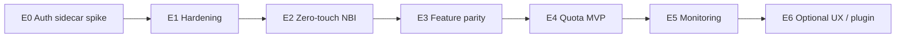

# Internal LLM Gateway + NBI — User Stories & Sub-tasks

Backlog derived from [`internal-llm-gateway-integration.md`](internal-llm-gateway-integration.md).

## Implementation status (repo)

In-tree spike under [`../local-dev/`](../local-dev/README.md). **Use Python ≥ 3.12** (`conda activate nbi-jl45`); never system 3.9. Re-run `./local-dev/run-regression.sh` after changes.

| Story       | Status              | Notes                                                                                 |
| ----------- | ------------------- | ------------------------------------------------------------------------------------- |
| LLM-S01     | **Done (local)**    | Sidecar + loopback refuse test; Hub pod proof still manual                            |
| LLM-S02     | **Done (local)**    | entrypoint + `Dockerfile.singleuser` + supervisord example                            |
| LLM-S03     | **Done (local)**    | Refresh + `tabletop-chaos.sh` TTL drill                                               |
| LLM-S04     | **Done (local)**    | CA env + `extract-ca-from-jks.sh`; verify gated in sidecar                            |
| LLM-S05     | **Done (manifest)** | NetworkPolicy example — apply on cluster TBD                                          |
| LLM-S06     | **Done (manifest)** | Secret + KubeSpawner volume snippet — real secrets out of band                        |
| LLM-S07     | **Done (local)**    | bake config + Dockerfile bake path                                                    |
| LLM-S08     | **Done (docs)**     | disabled_providers + break-glass in runbook                                           |
| LLM-S09     | **Done (local)**    | Inline config + FIM probe; corp latency TBD                                           |
| LLM-S10     | **Done (local)**    | Feature matrix + Agent-off; corp TBD                                                  |
| LLM-S11–S15 | **Done (local)**    | Quota svc K8s YAML + HTTP backend smoke + fail-closed                                 |
| LLM-S16     | **Done (local)**    | metrics / Grafana / alerts / log redact                                               |
| LLM-S17–S18 | **Done (local)**    | `/v1/usage/summary`, CSV export, tabletop chaos, runbook                              |
| LLM-S19     | **Done (local)**    | `llm-quota` proxy + badge + soft-cap banner                                           |
| LLM-S20     | **Done**            | ADR: sidecar-only                                                                     |
| LLM-S21     | **Deferred**        | ADR in `local-dev/docs/adr-central-gateway-keys.md`                                   |
| LLM-S22     | **Done (local)**    | feature header + caps + metrics by feature                                            |
| LLM-S23     | **Partial**         | probe + matrix merge; **corp probe** still TBD                                        |
| LLM-S24     | **Done (local)**    | regression + chaos + [`go-live-checklist.md`](../local-dev/docs/go-live-checklist.md) |

Remaining work is **cluster / corp-gateway only** — see
[`../local-dev/docs/remaining-tasks.md`](../local-dev/docs/remaining-tasks.md) and
[`../local-dev/docs/go-live-checklist.md`](../local-dev/docs/go-live-checklist.md).

**Conventions**

| Field         | Meaning                                                 |
| ------------- | ------------------------------------------------------- |
| **Epic**      | Phase / capability theme (maps to P0–P6)                |
| **Story**     | User- or operator-valuable outcome (INVEST-style)       |
| **Sub-tasks** | Implementable work items (≈0.5–2 days each)             |
| **Reqs**      | Spec requirement IDs (F\*, N\*)                         |
| **Owner**     | Suggested team: Platform / Quota / NBI / Model / SecOps |

**Priority:** P0 must-ship → P2 nice-to-have within that epic. Story IDs are stable for tracking (`LLM-Sxx`).

---

## Epic map

| Epic                                           | Phase | Goal                                        |
| ---------------------------------------------- | ----- | ------------------------------------------- |
| [E0](#epic-e0--auth-sidecar-spike-p0)          | P0    | Chat works via sidecar → gateway            |
| [E1](#epic-e1--production-hardening-p1)        | P1    | Refresh, TLS, process mgr, NetworkPolicy    |
| [E2](#epic-e2--zero-touch-user-experience-p2)  | P2    | Locked NBI defaults, no Settings ceremony   |
| [E3](#epic-e3--feature-parity--validation-p3)  | P3    | Streaming, inline, tools matrix + runbook   |
| [E4](#epic-e4--per-user-quota-mvp-p4)          | P4    | Identity → plan → enforce → 429             |
| [E5](#epic-e5--usage-monitoring--reporting-p5) | P5    | Metrics, dashboards, reports                |
| [E6](#epic-e6--optional-enhancements-p6)       | P6    | Lab quota UI, custom provider, central keys |

---

## Epic E0 — Auth sidecar spike (P0)

### LLM-S01 — As a Hub user, I can chat in NBI using the internal model without GitHub Copilot

**Reqs:** F1, F2, F6, F8 · **Owner:** Platform + NBI

> **Local spike:** use [`../local-dev/README.md`](../local-dev/README.md) (`./local-dev/start-local-stack.sh`) before Hub work.

**Acceptance**

- [ ] In a Hub user pod, NBI chat returns a streamed (or full) reply from `databricks/gdp-gpt4o` (or chosen model). _(cluster)_
- [x] No GitHub Copilot login is required. _(local: `disabled_providers`)_
- [x] Traffic path is NBI → `127.0.0.1` sidecar → LLM Gateway. _(local mock/proxy)_

**Sub-tasks**

| ID        | Task                                                                              | Owner    |
| --------- | --------------------------------------------------------------------------------- | -------- |
| LLM-S01.1 | Scaffold auth sidecar that proxies `POST /v1/chat/completions` to the gateway     | Platform |
| LLM-S01.2 | Integrate JAR mint (`get_bearer_token` equivalent); cache token in memory         | Platform |
| LLM-S01.3 | Bind sidecar to `127.0.0.1:<port>` only                                           | Platform |
| LLM-S01.4 | Point NBI `openai-compatible` at `http://127.0.0.1:<port>/v1` with `model_id` set | NBI      |
| LLM-S01.5 | Prove chat round-trip in one Hub pod; capture curl + NBI screenshot/log evidence  | Platform |

---

### LLM-S02 — As a platform engineer, I can run sidecar + Jupyter from a singleuser image entrypoint

**Reqs:** F8, N6 · **Owner:** Platform

**Acceptance**

- [x] Pod start brings up sidecar then (or with) Jupyter singleuser. _(entrypoint / Dockerfile)_
- [x] Sidecar ready before first NBI call (or NBI retries until ready). _(`/healthz` wait in entrypoint)_

**Sub-tasks**

| ID        | Task                                                                     | Owner    |
| --------- | ------------------------------------------------------------------------ | -------- |
| LLM-S02.1 | Add supervisord/s6/entrypoint to start sidecar + `jupyterhub-singleuser` | Platform |
| LLM-S02.2 | Add sidecar `/healthz` (process up + optional token warm)                | Platform |
| LLM-S02.3 | Document local/dev run instructions for the spike image                  | Platform |

---

## Epic E1 — Production hardening (P1)

### LLM-S03 — As a Hub user, my LLM session keeps working across OIDC token expiry

**Reqs:** F7, N6 · **Owner:** Platform

**Acceptance**

- [x] With short test TTL, chat still succeeds after refresh without user action. _(tabletop)_
- [x] Failed mint retries with backoff; clear error if IdP down. _(RetryingTokenProvider)_

**Sub-tasks**

| ID        | Task                                               | Owner    |
| --------- | -------------------------------------------------- | -------- |
| LLM-S03.1 | Implement refresh loop (`expires_in - skew`)       | Platform |
| LLM-S03.2 | Serialize mint calls; avoid thundering herd on 401 | Platform |
| LLM-S03.3 | Chaos test: force expiry mid-session               | Platform |

---

### LLM-S04 — As SecOps, LLM egress uses corp CA trust (not blanket `verify=False` in NBI)

**Reqs:** N2, §13 · **Owner:** Platform + SecOps

**Acceptance**

- [x] Sidecar trusts gateway/IdP via mounted CA bundle (or documented residual risk if verify disabled **only** in sidecar). _(CA env + extract-ca-from-jks; corp PEM mount still cluster)_
- [x] NBI itself does not set `verify=False`. _(code scan)_

**Sub-tasks**

| ID        | Task                                                                | Owner    |
| --------- | ------------------------------------------------------------------- | -------- |
| LLM-S04.1 | Extract/export trust material from JKS → PEM if needed              | Platform |
| LLM-S04.2 | Wire `SSL_CERT_FILE` / `REQUESTS_CA_BUNDLE` (or sidecar-equivalent) | Platform |
| LLM-S04.3 | Remove or gate `verify=False`; document exception if unavoidable    | SecOps   |

---

### LLM-S05 — As SecOps, user pods cannot call the LLM Gateway except via the sidecar

**Reqs:** N7, §12.4, §16 · **Owner:** Platform + SecOps

**Acceptance**

- [ ] NetworkPolicy (or equivalent) denies direct gateway egress from notebook containers.
- [ ] Sidecar (or approved egress) can still reach IdP + gateway.

**Sub-tasks**

| ID        | Task                                                                  | Owner    |
| --------- | --------------------------------------------------------------------- | -------- |
| LLM-S05.1 | Draft NetworkPolicy allowlist (DNS, Hub, IdP, gateway)                | SecOps   |
| LLM-S05.2 | Apply to Hub user namespace; verify deny path with curl from notebook | Platform |
| LLM-S05.3 | Add periodic egress audit note to runbook                             | SecOps   |

---

### LLM-S06 — As a platform engineer, JAR/JKS secrets are not in git or user home

**Reqs:** N1, N3, §13 · **Owner:** Platform

**Acceptance**

- [ ] JAR + JKS mounted read-only from Secret/CSI; mode `0400`.
- [ ] Passwords only via Secret env; never in `config.json`.

**Sub-tasks**

| ID        | Task                                              | Owner    |
| --------- | ------------------------------------------------- | -------- |
| LLM-S06.1 | Define K8s Secret/CSI volume layout for JAR + JKS | Platform |
| LLM-S06.2 | Inject keystore passwords via Secret env          | Platform |
| LLM-S06.3 | Document rotation procedure for JKS / JAR         | Platform |

---

## Epic E2 — Zero-touch user experience (P2)

### LLM-S07 — As a new Hub user, NBI works with the internal model without opening Settings

**Reqs:** F1, F6, N4 · **Owner:** NBI + Platform

**Acceptance**

- [x] Fresh spawn: chat works with baked `chat_model` / `inline_completion_model` pointing at sidecar. _(local bake + config; Hub PVC still cluster)_
- [x] `github-copilot` (and other SaaS providers as decided) hidden via `disabled_providers`. _(jupyter_server_config.py)_

**Sub-tasks**

| ID        | Task                                                                              | Owner    |
| --------- | --------------------------------------------------------------------------------- | -------- |
| LLM-S07.1 | Bake `<sys.prefix>/share/jupyter/nbi/config.json` (runtime schema §10) into image | NBI      |
| LLM-S07.2 | Set `c.NotebookIntelligence.disabled_providers` in server config                  | NBI      |
| LLM-S07.3 | Lock provider/model via `NBI_CHAT_MODEL_*` / inline env vars                      | NBI      |
| LLM-S07.4 | Smoke: new PVC user, zero Settings clicks                                         | Platform |

---

### LLM-S08 — As an admin, users cannot switch NBI to a broken external provider by default

**Reqs:** F6, N4 · **Owner:** NBI

**Acceptance**

- [x] Settings dropdown does not offer Copilot (and other disabled IDs). _(disabled_providers wiring)_
- [x] Document how break-glass re-enables a provider if needed. _(runbook)_

**Sub-tasks**

| ID        | Task                                             | Owner |
| --------- | ------------------------------------------------ | ----- |
| LLM-S08.1 | Verify traitlet + env lock behavior on Hub image | NBI   |
| LLM-S08.2 | Add admin runbook section for break-glass        | NBI   |

---

## Epic E3 — Feature parity & validation (P3)

### LLM-S09 — As a developer, I get inline autocomplete from the internal model

**Reqs:** F3 · **Owner:** NBI + Model

**Acceptance**

- [x] Typing in a code cell yields inline suggestions via the same sidecar path. _(inline model baked + FIM smoke; UI quality still corp)_
- [x] Debounce/cost note documented for operators. _(feature-matrix / runbook)_

**Sub-tasks**

| ID        | Task                                                   | Owner |
| --------- | ------------------------------------------------------ | ----- |
| LLM-S09.1 | Confirm inline model config in baked `config.json`     | NBI   |
| LLM-S09.2 | Validate gateway quality/latency for FIM-style prompts | Model |
| LLM-S09.3 | Document expected UX if gateway is slow                | NBI   |

---

### LLM-S10 — As a platform engineer, I know which NBI features the gateway supports

**Reqs:** F4, F5 · **Owner:** Model + NBI

**Acceptance**

- [x] Written matrix: streaming / tools / vision / agent — Supported / Degraded / Off. _(feature-matrix.md; Corp column TBD)_
- [x] Agent mode disabled or documented if tools unsupported. _(feature-matrix Agent section)_

**Sub-tasks**

| ID        | Task                                               | Owner |
| --------- | -------------------------------------------------- | ----- |
| LLM-S10.1 | Test streaming chat completions end-to-end         | Model |
| LLM-S10.2 | Test OpenAI `tools` against gateway; record result | Model |
| LLM-S10.3 | Publish internal runbook (enable/disable Agent)    | NBI   |
| LLM-S10.4 | Multi-turn chat history smoke test in NBI UI       | NBI   |

---

## Epic E4 — Per-user quota MVP (P4)

### LLM-S11 — As a Hub user, after login I am automatically bound to an LLM quota for my identity

**Reqs:** F9, F10 · **Owner:** Platform + Quota

**Acceptance**

- [x] No second LLM login. _(sidecar JAR/mock auth)_
- [x] Pod receives `NBI_LLM_USER` (and groups/plan metadata) from Hub spawn. _(pre_spawn_hook; Hub apply still cluster)_
- [x] Two users with different groups get different plans automatically. _(local two-plan test; Hub proof still cluster)_

**Sub-tasks**

| ID        | Task                                                                     | Owner    |
| --------- | ------------------------------------------------------------------------ | -------- |
| LLM-S11.1 | Confirm Authenticator stable username + `manage_groups` (if group plans) | Platform |
| LLM-S11.2 | Implement Quota Service `resolve_plan(username, groups, auth_state)`     | Quota    |
| LLM-S11.3 | Implement Hub `pre_spawn_hook` env injection (`NBI_LLM_*`)               | Platform |
| LLM-S11.4 | Canonicalize subject key (email vs short name) — single rule             | Quota    |
| LLM-S11.5 | Integration test: user A=`intern`, user B=`standard`                     | Platform |

---

### LLM-S12 — As a quota admin, I can define plans (tokens/day, requests/day, model allow-list)

**Reqs:** F10, §12.3 · **Owner:** Quota

**Acceptance**

- [x] Plans `intern` / `standard` / `power` (or org equivalents) exist in central catalog. _(plans.json)_
- [x] Resolution order: user override → group → default. _(quota_store + tests)_

**Sub-tasks**

| ID        | Task                                              | Owner |
| --------- | ------------------------------------------------- | ----- |
| LLM-S12.1 | Design plan schema (DB or ConfigMap + API)        | Quota |
| LLM-S12.2 | Seed initial plans and group mapping rules        | Quota |
| LLM-S12.3 | Admin API or config PR process to change plans    | Quota |
| LLM-S12.4 | Document break-glass `PUT /v1/quota/{user}` boost | Quota |

---

### LLM-S13 — As the platform, every LLM call is metered and attributed to the Hub user

**Reqs:** F11, N8, N9 · **Owner:** Platform + Quota

**Acceptance**

- [x] Sidecar check → proxy → commit using gateway `usage` tokens. _(mock + proxy path; corp usage still TBD)_
- [x] Counters survive pod restart (durable store). _(file store test)_
- [x] Prompts/completions not stored in metering DB by default. _(events = aggregates only)_

**Sub-tasks**

| ID        | Task                                                          | Owner    |
| --------- | ------------------------------------------------------------- | -------- |
| LLM-S13.1 | Provision Redis/Postgres (or approved store) for counters     | Quota    |
| LLM-S13.2 | Sidecar: `reserve_or_check` before upstream call              | Platform |
| LLM-S13.3 | Sidecar: parse `usage` (incl. streaming final chunk strategy) | Platform |
| LLM-S13.4 | Sidecar: `commit` actual tokens + model + feature             | Platform |
| LLM-S13.5 | Re-validate plan via Quota Service (do not trust env alone)   | Platform |
| LLM-S13.6 | Test: restart pod mid-day; counters unchanged                 | Quota    |

---

### LLM-S14 — As a Hub user, when my daily quota is exhausted I see a clear error and JupyterLab still works

**Reqs:** F12, §12.6 · **Owner:** Platform + NBI

**Acceptance**

- [x] Over quota → HTTP 429 with `quota_exceeded` style message. _(sidecar + smoke)_
- [x] Chat shows actionable text (plan + reset time). _(format_openai_compatible_error)_
- [x] Notebook editing continues; only LLM calls fail. _(inline quiet-fail documented)_

**Sub-tasks**

| ID        | Task                                                   | Owner    |
| --------- | ------------------------------------------------------ | -------- |
| LLM-S14.1 | Standardize 429 JSON error body from sidecar           | Platform |
| LLM-S14.2 | Verify NBI chat surfaces upstream error text           | NBI      |
| LLM-S14.3 | Document inline-completer behavior on 429              | NBI      |
| LLM-S14.4 | Soft-cap metric at 80% (alert only); hard deny at 100% | Quota    |
| LLM-S14.5 | End-user help blurb for Hub portal / FAQ               | Platform |

---

### LLM-S15 — As SecOps, users cannot raise their own quota by editing pod env or NBI Settings

**Reqs:** N7, §12.2 trust note · **Owner:** Platform + Quota

**Acceptance**

- [x] Editing `NBI_LLM_PLAN` in the pod does not increase enforced limits. _(forge ignored tests)_
- [ ] Direct gateway calls from notebook fail (ties to LLM-S05). _(cluster NetworkPolicy)_

**Sub-tasks**

| ID        | Task                                                            | Owner    |
| --------- | --------------------------------------------------------------- | -------- |
| LLM-S15.1 | Sidecar ignores client plan for enforcement; uses Quota Service | Platform |
| LLM-S15.2 | Negative test: forged env / headers → still `standard` limits   | Quota    |
| LLM-S15.3 | Review impersonation / “play as user” quota attribution         | Platform |

---

## Epic E5 — Usage monitoring & reporting (P5)

### LLM-S16 — As an operator, I can see per-user and per-plan LLM usage for the last 24 hours

**Reqs:** F13, §12.7 · **Owner:** Quota + Platform

**Acceptance**

- [x] Grafana (or equiv.) shows tokens/requests by user, team, plan, model. _(dashboard JSON in-tree; import still cluster)_
- [x] Denial rate (`quota_exceeded`) visible. _(denials metric + panel)_

**Sub-tasks**

| ID        | Task                                                                        | Owner    |
| --------- | --------------------------------------------------------------------------- | -------- |
| LLM-S16.1 | Emit Prometheus metrics (`nbi_llm_tokens_total`, request counters, latency) | Platform |
| LLM-S16.2 | Build Grafana dashboard (usage, top users, errors)                          | Quota    |
| LLM-S16.3 | Alert: store down, denial spike, soft-cap breaches                          | Quota    |
| LLM-S16.4 | Redact Authorization / secrets from sidecar logs                            | Platform |

---

### LLM-S17 — As an operator, I can export daily/monthly usage reports

**Reqs:** F13 · **Owner:** Quota

**Acceptance**

- [x] Job or query answers “who used how much yesterday/month?”. _(/v1/usage/summary + CronJob example)_
- [x] Report contains aggregates only (no prompt bodies).

**Sub-tasks**

| ID        | Task                                                         | Owner |
| --------- | ------------------------------------------------------------ | ----- |
| LLM-S17.1 | Async events to Kafka/OTel → warehouse (or batch from store) | Quota |
| LLM-S17.2 | Daily aggregation job + monthly rollup                       | Quota |
| LLM-S17.3 | Admin API `GET /v1/usage?user=&from=&to=`                    | Quota |
| LLM-S17.4 | Sample CSV/report for FinOps / team leads                    | Quota |

---

### LLM-S18 — As an operator, I have a defined runbook for quota incidents

**Reqs:** §12.10 · **Owner:** Quota + Platform

**Acceptance**

- [x] Runbook covers raise quota, reset window, break-glass, sidecar/IdP outage. _(runbook.md + tabletop)_

**Sub-tasks**

| ID        | Task                                           | Owner    |
| --------- | ---------------------------------------------- | -------- |
| LLM-S18.1 | Write runbook pages (link from Hub admin docs) | Platform |
| LLM-S18.2 | Tabletop: IdP down, Redis down, mass 429       | Quota    |

---

## Epic E6 — Optional enhancements (P6)

### LLM-S19 — As a Hub user, I can see remaining LLM quota in JupyterLab

**Reqs:** F13 (UX), §12.6 · **Owner:** NBI · **Priority:** P2

**Acceptance**

- [x] Optional indicator reads `GET http://127.0.0.1:<port>/quota`. _(via `/llm-quota`)_
- [x] Display is informational; enforcement remains server-side. _(badge + soft-cap banner)_

**Sub-tasks**

| ID        | Task                                                   | Owner    |
| --------- | ------------------------------------------------------ | -------- |
| LLM-S19.1 | Sidecar `GET /quota` → `{plan, used, limit, reset_at}` | Platform |
| LLM-S19.2 | Small Lab extension or NBI status affordance           | NBI      |
| LLM-S19.3 | UX copy for soft-cap warning                           | NBI      |

---

### LLM-S20 — As a product owner, we evaluate a branded NBI provider plugin vs sidecar-only

**Reqs:** §8, §14 P6 · **Owner:** NBI · **Priority:** P2

**Acceptance**

- [x] Decision record: stay sidecar-only **or** build `corp-llm-gateway` plugin. _(adr-sidecar-vs-plugin: sidecar-only)_
- [ ] If plugin: JAR refresh + register via `nbi_extensions`. _(N/A — deferred)_

**Sub-tasks**

| ID        | Task                                                      | Owner |
| --------- | --------------------------------------------------------- | ----- |
| LLM-S20.1 | Compare ops cost sidecar vs in-process plugin             | NBI   |
| LLM-S20.2 | ADR / decision in integration doc appendix                | NBI   |
| LLM-S20.3 | (If go) Scaffold `NotebookIntelligenceExtension` provider | NBI   |

---

### LLM-S21 — As a platform, we optionally move per-user metering to the central LLM Gateway

**Reqs:** §12.4 central option · **Owner:** Model + Quota · **Priority:** P2

**Acceptance**

- [x] Decision: sidecar meters **or** gateway native per-user keys/headers. _(adr-central-gateway-keys: sidecar for now)_
- [ ] If gateway: spawn maps Hub user → gateway consumer; sidecar keeps JAR platform auth. _(deferred)_

**Sub-tasks**

| ID        | Task                                            | Owner |
| --------- | ----------------------------------------------- | ----- |
| LLM-S21.1 | Spike gateway per-user quota APIs               | Model |
| LLM-S21.2 | Design identity header / key mint at spawn      | Quota |
| LLM-S21.3 | Migration plan from sidecar counters if adopted | Quota |

---

### LLM-S22 — As FinOps, chat vs inline spend can be capped separately

**Reqs:** F11, §12.5 · **Owner:** Platform + NBI · **Priority:** P2

**Acceptance**

- [x] Feature tag (`chat` \| `inline` \| `agent`) on metered events. _(X-NBI-Feature)_
- [x] Optional separate budgets in plan schema. _(tokens_per_day_chat/inline)_

**Sub-tasks**

| ID        | Task                                                            | Owner            |
| --------- | --------------------------------------------------------------- | ---------------- |
| LLM-S22.1 | Choose approach: `X-NBI-Feature` header vs dual localhost ports | Platform         |
| LLM-S22.2 | Implement tagging + plan fields                                 | Platform + Quota |
| LLM-S22.3 | Dashboard split by feature                                      | Quota            |

---

## Cross-cutting / discovery stories

### LLM-S23 — As the project, we close gateway capability unknowns before P3 exit

**Reqs:** §16 · **Owner:** Model

**Sub-tasks**

| ID        | Task                                                      |
| --------- | --------------------------------------------------------- |
| LLM-S23.1 | Confirm streaming + `usage` on final chunk                |
| LLM-S23.2 | Confirm tool calling support                              |
| LLM-S23.3 | Confirm model id(s) and context window for config bake-in |

---

### LLM-S24 — As QA, we maintain an automated/regression checklist for Hub + NBI + sidecar

**Reqs:** §15 · **Owner:** Platform + NBI

**Sub-tasks**

| ID        | Task                                                                    |
| --------- | ----------------------------------------------------------------------- |
| LLM-S24.1 | Automate smoke: extensions OK, chat, inline, token refresh              |
| LLM-S24.2 | Automate quota: two plans, over-quota 429, counter durability           |
| LLM-S24.3 | Security smoke: no secrets in browser HAR; gateway deny without sidecar |

---

## Suggested sprint slicing

| Sprint theme                   | Stories                                     |
| ------------------------------ | ------------------------------------------- |
| Sprint 1 — Path to first token | LLM-S01, LLM-S02, LLM-S23 (partial)         |
| Sprint 2 — Harden              | LLM-S03, LLM-S04, LLM-S05, LLM-S06          |
| Sprint 3 — Zero-touch          | LLM-S07, LLM-S08, LLM-S09, LLM-S10          |
| Sprint 4 — Quota               | LLM-S11, LLM-S12, LLM-S13, LLM-S14, LLM-S15 |
| Sprint 5 — Observe             | LLM-S16, LLM-S17, LLM-S18, LLM-S24          |
| Backlog / later                | LLM-S19–LLM-S22                             |

---

## Traceability (requirements → stories)

| Req                          | Stories       |
| ---------------------------- | ------------- |
| F1 Select / preselect model  | S01, S07      |
| F2 Chat streaming            | S01, S10      |
| F3 Inline completion         | S09           |
| F4 Multi-turn history        | S10           |
| F5 Tool calling              | S10, S23      |
| F6 No Copilot                | S01, S07, S08 |
| F7 Token refresh             | S03           |
| F8 Hub/K8s                   | S01, S02, S05 |
| F9 Identity from login       | S11           |
| F10 Auto quota plan          | S11, S12      |
| F11 Metering                 | S13, S22      |
| F12 Deny over quota          | S14           |
| F13 Monitor / report         | S16, S17, S19 |
| N1–N3 Secrets / multi-tenant | S06, S15      |
| N4 Bakeable config           | S07           |
| N5 Safe observability        | S16           |
| N6 Cold start                | S02, S03      |
| N7 Authoritative enforce     | S05, S13, S15 |
| N8 Durable counters          | S13           |
| N9 No prompt warehouse       | S13, S17      |

---

## Import tips (Jira / Azure Boards / Notion)

- Create **Epics** E0–E6; children = `LLM-Sxx` stories; checklist rows = sub-tasks.
- Story points: spike stories 5–8; hardening 3–5; quota core (S13) 8; dashboards 5.
- Labels: `nbi`, `llm-gateway`, `quota`, `jupyterhub`, `security`.
- Link each Epic to [`internal-llm-gateway-integration.md`](internal-llm-gateway-integration.md) §14 phase.

---

## Related docs

- Spec: [`internal-llm-gateway-integration.md`](internal-llm-gateway-integration.md)
- **Local test stack (JL 4.5.9 + NBI + mock sidecar):** [`../local-dev/README.md`](../local-dev/README.md)
- Hub admin: [`admin-guide.md`](admin-guide.md)
